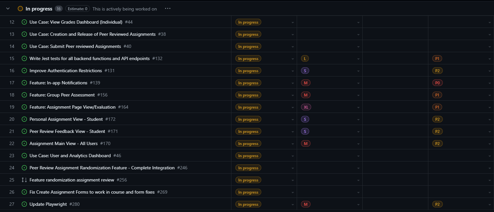
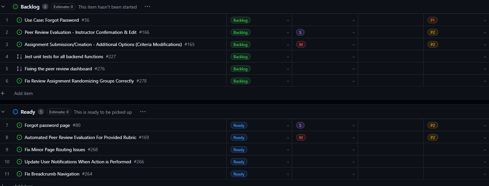
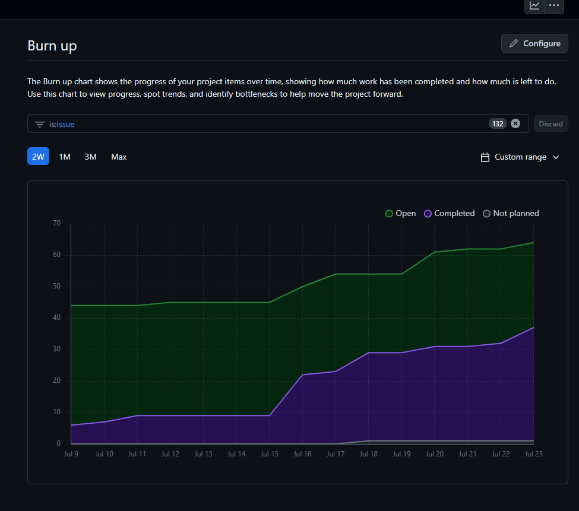
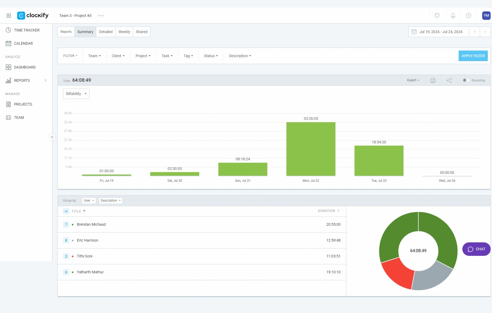

# Weekly Team Dashboard
## For Week 9 (07/17/2024) - (07/19/2024) 

    <h3>Feature Development Table</h3>
    <h4> Completed Features: </h4>
        
    <h4> In Progress Features: </h4>
        
    <h4> ToDo Features: </h4>
        
    <h3>Burnup</h3>
        
        <h3>Additional Items: </h3>
    <h4>Clokify for the week:</h4>
 
    <h4>Test 2 :</h4>
    
    

