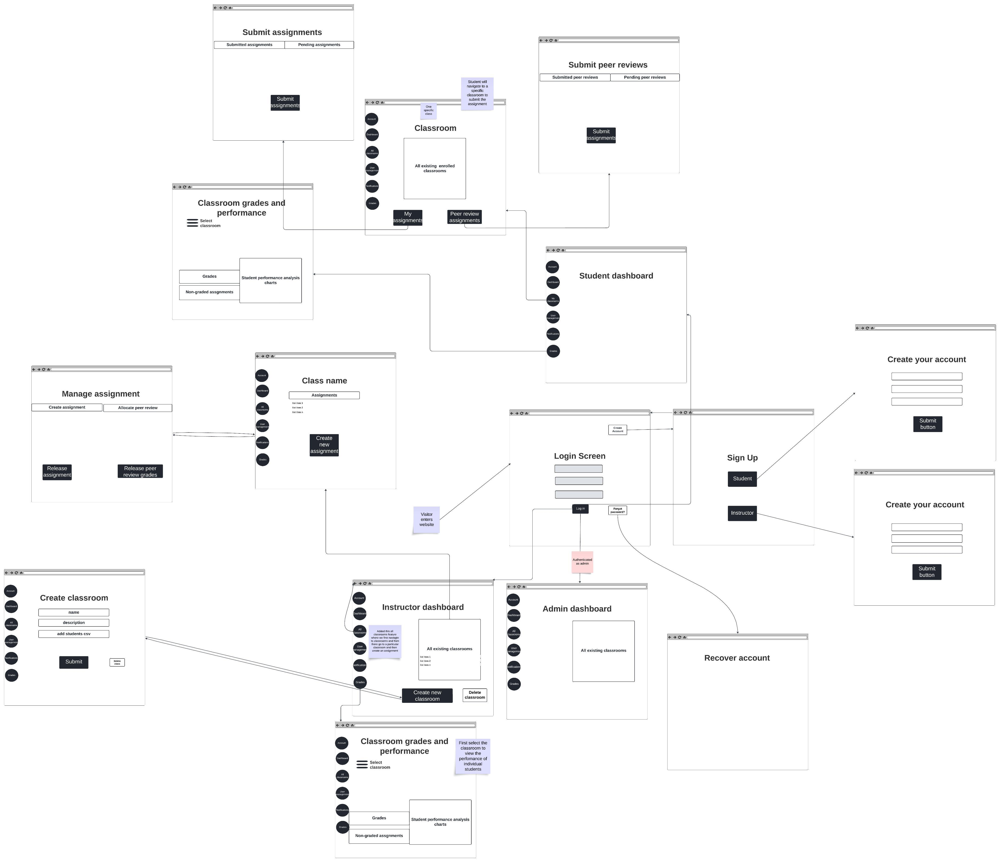

# System Design

## Introduction

Start with a brief introduction of **what** you are building, reminding the reader of the high-level usage scenarios (project purpose).   Complete each section with the required components.  Don't forget that you can include [images in your markdown](https://docs.github.com/en/get-started/writing-on-github/getting-started-with-writing-and-formatting-on-github/basic-writing-and-formatting-syntax#images).  

Start each section with a lead-in, detailing what it is.  Also, do not just have a collection of images.   Each diagram must be explained clearly. **Do not assume that the reader understands the intentions of your designs**.

## System Architecture Design

The System Architecture Model we have chosen is MVC, due to its simple design, flexibility and maintainability. The simple and organized structure of this architecture allows our application to be well organized and easily testable through development. As the MVC pattern separates the system components into three layers, each component can be subdivided and isolated. This makes it easy to add/change features which can be tested independently of others. With each layer handling different functions of the system, development on one will not conflict with another, thus allowing us to build the system in parallel. The simple structure of a web application makes this pattern the best fit, due to the clear separation of each layer.

As an MVC pattern, our system is divided into the 3 main layers: 
* **Model**          
* **View**
* **Controller**

Each layer contains one or several components, where those components are isolated in their own container. Outside the layers, the ***"Users"*** indicates any user that accesses the application, which is sent to a reverse proxy to determine user type and proper navigation. This protocol is not directly connected to the application but containerized as a transfer protocol telling the controller which view component to access. The View layer is the front-end system the users will interact with which makes the requests to the controller. This layer contains two main view components: **the instructor dashboard and the student dashboard**, which may interact with each other, but act independently. The Controller is simply our main system logic, handling all requests by the user, sending and receiving data from the model (Database), and interacting with added APIs. The chosen framework for the controller is Next.js, allowing for simple API integration and future scalability. Finally, the Model of our system is our database, which solely interacts with the controller, processing any requests and transmitting data back. The initial database framework chosen is MySQL as the database will be relational and its accessibility with Node, however this framework may change. 

## Use Case Models

Extending from your requirements, the team will need to develop a set of usage scenarios for each user group documented as properly dressed use cases  (including diagrams following the UML syntax and descriptions as presented in class).   You may also want to include journey lines with some use cases. 

## Database Design 

This diagram shows how information will be represented as objects in a relational schema.

* Users will be broken down into 1 of the 2 mandatory subclasses, students and instructors. Instructors are connected to classes, assignments, and other users with some of their permissions depending on the isAdmin attribute. 
* Students are connected to the classes they're in, and they're connected to assignments through the weak entities that store information regarding their submissions and feedback.
* Classes are connected to the assignments within them, with the isArchived boolean being a foreign key so it's easy to archive all assignments within an archived class.

## Data Flow Diagram (Level 0/Level 1)

The team is required to create comprehensive Level 0 and Level 1 Data Flow Diagrams (DFDs) to visually represent the system’s data flow, including key processes, data stores, and data movements.  The deliverables will include a high-level context diagram, a detailed Level 1 DFD, and supporting documentation to facilitate the understanding of data movement within the system.   Remember that within a L1 DFD, the same general level of abstraction should apply to all processes (review 310 notes for guidance),

## User Interface (UI) Design

The team is required to put forward a series of UI mock-ups that will be used as starting points for the design of the system   They can be minimal but the team will need to  have at least made some choices about the interaction flow of the application.  You should consider the different major aspects of user interactions and develop UI mockups for those (think about the different features/use cases and what pages are needed; you will have a number most likely).  Additionally, create a diagram to explain the navigation flow for the MVP  prototype (and any alternate flows).  When considering your UI, think about usability, accessibility, desktop and mobile uses.  As a team, you will need to discuss design choices for the system.

### Wireflow Diagram:

[Wireflow link here](https://lucid.app/lucidspark/27f7f586-1c38-438d-a66a-0492e525870c/edit?viewport_loc=-6787%2C-1561%2C7408%2C4182%2C0_0&invitationId=inv_a3cddd55-2816-4b02-b069-d5f64d055270)
