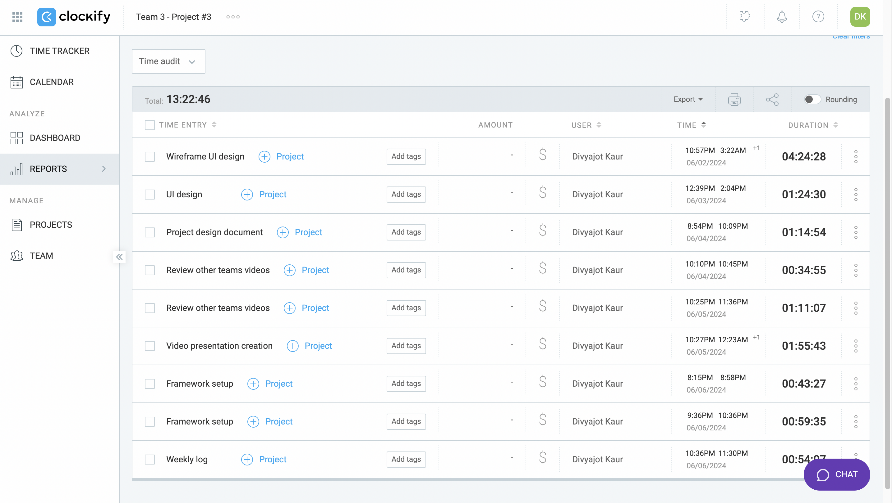

 # Weekly Logs 
------------------------------------
## Week 1 
* Meet and greet 
* Team formations
* Ice breaker
## Week 2
  Team meeting notes:
* Established Communication channels
* Chose our team name -Sprint runners
* First official meeting (1 hour)
* Division of action items on the Project Proposal
      
  My contributions:  
     
     - Set up the project Kanban board on github and manage dashboard
     - General research on other peer-review applications
     - Update High level requirements and boundaries in the project proposal document (1.5 hrs)
     - Update risks section in the project proposal document
     - Review Project proposal document
    
 ## Week 3
   Team meeting notes:
  * Review of project proposal and feedback
  * Project Proposal video presentation creation and review
  * Begin design documentation
  * Completing final parts of project proposal (assumtions and constraints + tech stack)
  * Reading and reviewing the project proposal
  * Incorperating feedback into proposal
  * Project Proposal video presentation creation
  * Project Proposal Video creation/editing/compilation
  * Design Documentation started, and divied up between team members
  * System Architecture Design
  * Use Case Models
  * Database design / Relational Model
  * DFD Level 0 and 1
  * UI Design

    My contributions:  
     
     - Kanban board management
     - Video presentation 
     - Video creation of my part
     - Updating tech stack section in project proposal document 
     - Review final Project proposal document 
     - Wireframing and UI design prototyping
     - Project board management and task assignment on kanban board, categorization of tasks to milestones and Tshirt sizing of tasks
   
# Week 4  
## Wednesday June 5 2024

### Timesheet

### Current Tasks 
  * Make changes in UI design wireflow based on team meeting feedback.
  * Add tasks to milestones in kanban board.
  * Install Docker, Node, and NPM
    
    

### Progress Update (since 29 May 2024)
<table>
    <tr>
        <td><strong>TASK/ISSUE #</strong>
        </td>
        <td><strong>STATUS</strong>
        </td>
    </tr>
    <tr>
        <!-- Task/Issue # -->
        <td>Start & finish wireflow for the web application and UI design
        </td>
        <!-- Status -->
        <td> Done
        </td>
    </tr>
    <tr>
        <!-- Task/Issue # -->
        <td> Accept and set up clokify as per instructions 
        </td>
        <!-- Status -->
        <td> Done
        </td>
    </tr>
    <tr>
        <!-- Task/Issue # -->
        <td> Design proposal document UI mockup section upload
        </td>
        <!-- Status -->
        <td> Done
        </td>
    </tr>
        <tr>
        <!-- Task/Issue # -->
        <td> Learn React
        </td>
        <!-- Status -->
        <td> In progress
        </td>
    </tr>
    <tr>
        <!-- Task/Issue # -->
        <td> Meeting w/ client (5/31/2024)
        </td>
        <!-- Status -->
        <td> Done
        </td>
    </tr>
          <tr>
        <!-- Task/Issue # -->
        <td>  UI design wireflow updating and reviewing</td>
        <!-- Status -->
        <td> In progress
        </td>
    </tr>
    
</table>

### Weekly Goal Review
 I am now working on the video presentation creation. Adding the updated UI mockup wireflow to the document. 

### Next Cycle Goals
  * Design Video presentation template and recording
  * Adding UI mockups to the design document.

## Friday June 7 2024

### Current Tasks (Complete by the end of the day)
  * Video presentation template is created
  * Video presentation is compiled
  * Need to ensure all set up is done during the team meeting and hello world live on all systems
  * Start writing tests based on tests cases

### Progress Update (since 29 May 2024)
<table>
    <tr>
        <td><strong>TASK/ISSUE #</strong></td>
        <td><strong>STATUS</strong></td>
    </tr>
    <!-- Done tasks -->
    <tr>
        <td>Adding UI wireflow to the design document</td>
        <td>Done</td>
    </tr>
    <tr>
        <td>Video presentation template</td>
        <td>Done</td>
    </tr>
    <tr>
        <td>Setup framework</td>
        <td>Done</td>
    </tr>
    <tr>
        <td>UI design wireflow updating and reviewing</td>
        <td>Done</td>
    </tr>
    <!-- In progress tasks -->
    <tr>
        <td>Learn React</td>
        <td>In progress</td>
    </tr>
    <tr>
        <td>Learn Next.js</td>
        <td>In progress</td>
    </tr>
    <tr>
        <td>Test Cases</td>
        <td>In progress</td>
    </tr>
    <tr>
        <td>Final design video compilation</td>
        <td>In progress</td>
    </tr>
</table>

### Weekly Goal Review
  * I have created the project design video template and need a few inputs for the final submission and compilation.

### Next Cycle Goals
* Writing test cases
* Get features assigned and start development

   
