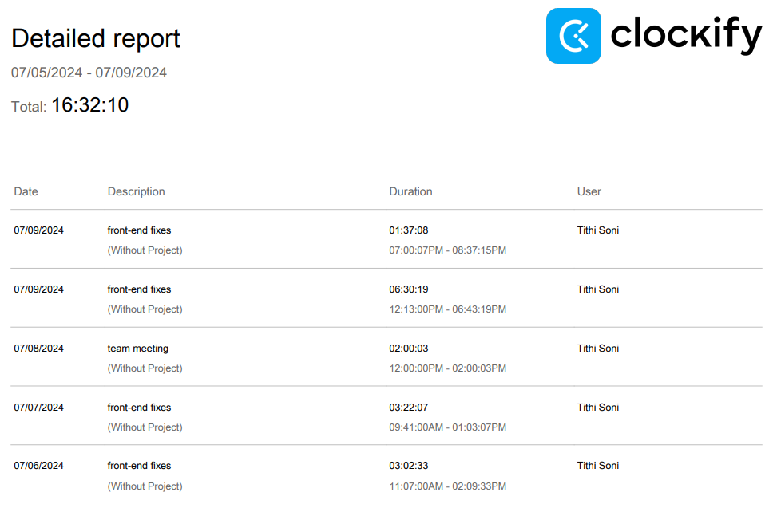
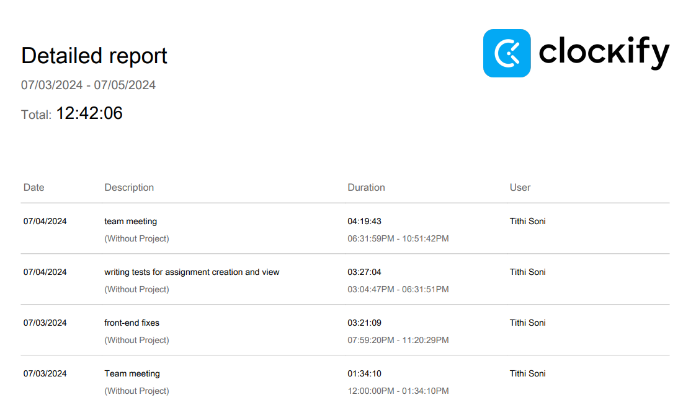

# Weekly Personal Logs

## Personal Log For Week 9

### 07/10/2024

Topics Covered:
* researching HCI concepts and its applications
* researching UI toolkits for React.js/Next.js

My contributions since Friday's log:

Since Friday, I've been looking into my COSC 341 notes for HCI concepts and how to improve our UI design as per Parsa's inputs which we received last Wednesday. We had decided to focus on our integration rather than our frontend for most of the features we have been working on so a lot of the feedback we received was expected. For the demo, we made so minor UI changes so that our application looked presentable but the major changes are planned for the upcoming week. I found a Next.js UI framework called NextUI which I have been working on integrating with our system. I'm still having some issues with setting up the themes in the tailwind.config.ts file but the framework is pretty well integrated into the system regardless. I also updated the landing and registration pages for the student users using the framework.

| Task | Due By | Status |
| ------- | ------- | ------- |
| Create templates for the rest of the student pages using the NextUI framework | 07/12/2024 | WIP |
| Rebuild the navigation system to have slide out feature and favicons | 07/12/2024 | WIP |
| Add frontend restrictions for users | 07/12/2024 | WIP |
| Add FAQ or tooltips throughout the website for accessibility | 07/12/2024 | WIP |

## Personal Log For Week 8

### 07/03/2024

Topics Covered:
* testing all the features we've worked on so far
* merging and integrating sub-features into their respective features branch and completed features into development

My contributions since Friday's log:

Since Friday, I've been working on the peer review form, and the advanced options part of the form. I had some issues with the advanced options, some of the functions weren't working properly and I wasn't getting the right data from the database which is why it took me so long to complete. We decided that the unique due date aspect of the advanced options is going to be moved to instead allow the instructor to edit individual due dates. 

| Task | Due By | Status |
| ------- | ------- | ------- |
| Work on integrating the peer review form into the student pages | 07/07/2024 | WIP |
| Write tests for the functions I've been working on | 07/04/2024 | Complete |
| Update UI to be consistent with prototype | 07/04/2024 | Complete |

### 07/05/2024

My contributions since Wednesday's log:
* wrote tests for student view and submit assignment
* created slide deck for MVP presentation
* worked on getting frontend presentable for MVP

| Task | Due By | Status |
| ------- | ------- | ------- |
| Update UI according to Parsa's inputs | 07/04/2024 | WIP |
| Integrate Peer Review Submission into student pages | 07/08/2024 | WIP |
| Make sure frontend has functional restrictions for user | 07/08/2024 | WIP |

#### Cycle Review and Goals

This last cycle was pretty hectic with getting tests done and making sure all of our key features for the MVP are functioning. We were pretty good about keeping up our pace for working and we spent the last couple of days making sure our features were functional, we had tests written for them, and the UI was up to date. I wasn't able to get to integrating the student Peer Review Submission form because to do that I need to change multiple assignment pages and add props or components that will build a page depending on the type of assignment. This also means making database changes which I'm holding off on because we want to optimize our database after the MVP presentation.

## Personal Log For Week 7

### 06/26/2024

Topics Covered:

* task split for assignment creation, assignment view, course creation, and course registration.
* get testing completely set up

My Contributions since Friday's log:
* made the upload file function, works with the instructor assignment creation form where instructor can upload a file with assignment details
* made the student assignments view, it shows all assignments that the student has received, and students can click on an assignment to see more details and submit the assignment
* worked with Yatharth on integrating the database to work with functions for file restrictions 

| Task | Due By | Status |
| ------- | ------- | ------- |
| Make upload file function to store assignment rubric in database | 06/23/2024 | Complete |
| Make student view and functionality for viewing all assignments | 06/23/2024 | Complete |
| Make student view and functionality for viewing selected assignment | 06/23/2024 | Complete |
| Make student view and functionality for uploading a restricted file for assignment  | 06/23/2024 | Complete; just needs state management for uploading submission to database |
| Make student view and functionality for viewing all assignments | 06/23/2024 | Complete |
| Make advanced options- restrictions section and functions for peer review page | 06/28/2024 | Complete |

### 06/26/2024

My Contributions since Wednesday's log:

I didn't get much work done since the last meeting because I had a final exam on the 27th. I'm planning to spend some more time working this weekend to make up for not working on the project for the last couple of days. 

| Task | Due By | Status |
| ------- | ------- | ------- |
| Make advanced options- restrictions section and functions for peer review page | 06/28/2024 | WIP |
| Work on tidying up the front-end design on the registration, login, dashboard, and assignment pages  | 06/29/2024 | WIP |
| Work on connecting the backend for the peer-review page  | 06/29/2024 | WIP |

#### Cycle Review And Goals

As a team, we got a lot of work done for the project this week despite how busy we all were with exams and jobs and such. In terms of my contributions, I got a lot of my work done earlier this week so I could focus on my final exam that was on the 27th. Half of the assignments section is complete, the half that remains is the peer-review and peer-evaluation portion which we are planning to work on this weekend. I want to get my tasks for the weekend done by Friday or Saturday so we can do testing and begin the peer evaluation feature.

## Personal Log For Week 6

### 06/19/2024

Topics Covered:

* feature breakdown
* testing drone with docker and working on features for mini-presentation
* feature task split between members

| Task | Due By | Status |
| ------- | ------- | ------- |
| Making page templates for all UI pages on Figma | 06/18/2024 | Complete |
| Setting up system navigation among all pages | 06/18/2024 | Complete |
| Upload file function on assignment creation for instructor  | 06/18/2024 | Complete |
| File viewer api for students to view assignment | 06/21/2024 | WIP |

### 06/21/2024

Topics Covered:

* researching on options uploading file to db and ui api options for it
* researching pdf viewer options for student view assignments

| Task | Due By | Status |
| ------- | ------- | ------- |
| File viewer api for students to view assignment | 06/21/2024 | WIP |
| Student view and submit assignment page | 06/21/2024 | WIP |

#### Cycle Review

This week was a little less work heavy in terms of hours spent. I think I completed a decent amount of work for the features we need done for tomorrow. I will have the student view and upload done by the end of day tomorrow so we can move onto testing the features over the weekend. We did have some issues working with the database this week so I was helping Yatharth with breaking down and fixing the issue. The goal is to be done with the assignment creation, course creation, assignment submission, and course registration by next Wednesday.

## Personal Log For Week 5

### 06/10/2024

Topics Covered:

* automating tests to run with docker
* having 5 key pages made: login for both student and instructor, dashboards, landing page, authentication setup

| Task | Due By | Status |
| ------- | ------- | ------- |
| Make student and instructor dashboards | 06/12/2024 | Complete |
| Forgot password functionality research | 06/12/2024 | Complete |

#### Weekly Cycle Review

* Eric and I had some issues setting up the database, it was creating a docker container but the connection was not being made with the framework
* There were quite a bit of issues with setting up the testing framework as well so Brendan is taking over that aspect
* I was able to get some of the navbar setup for the dashboard but I still have quite a few components to make before it can be called complete

### 06/13/2024

Topics Covered:
* updates on feature status
* debugged testing issues
* presentation part split between 4 members

| Task | Due By | Status |
| ------- | ------- | ------- |
| Create Presentation | 06/13/2024 | Complete |
| Work on dynamic aspect of navigation | 06/16/2024 | Not Started |
| Build more student and instructor pages | 06/16/2024 | Not Started |

#### Cycle Review From last meeting

* I was able to get a basic navbar and page header component built for student and instructor, and I was also able to get a very basic dashboard setup with these components
* We had a meeting today for discussing features and trying to solve our testing automation issue, we also did our integration and pull requests during our meeting

#### Upcoming Cycle Goals

* I want to have a dynamic header page for all users and I want to have at least two separate pages built by our Monday meeting

### 06/14/2024

## Personal Log For Week 4

### 06/03/24

Topics Covered:

* design document review
* er updates review
* dfd diagrams review
* architecture review
* student UI review

*Action Items*

| Task | Due By | Status |
| ------- | ------- | ------- |
| Complete detailed UI design for student and instructor | 06/05/2024 | Complete |

### 06/05/2024

Topics Covered:

* updating personal logs
* figma to code conversion
* task distribution up to next meeting: design video, framework setup, testing frameworks, setting up DroneCI and Docker

*Action Items*

| Task | Due By | Status |
| ------- | ------- | ------- |
| Look into Figma to code conversion options | 06/10/2024 | Complete |
| Complete admin section of UI design | 06/07/2024 | Complete |
| Record website walkthrough | 06/07/2024 | Complete |

#### Weekly Cycle Review

* I revamped the original design I had in mind and was able to build a consistent design that will be UX friendly
* Some aspects of the design like admin features are still being implemented
* I will be going through the entire prototype before filming to make sure the interactivity of the components is in the correct order

**06/07/2024**

Topics Covered:

* design video script
* deciding which features we want to make and who will make what

*Action Items*

| Task | Due By | Status |
| ------- | ------- | ------- |
| Record UI walkthrough | 06/07/2024 | Complete |
| Setup database and tests with Eric | 06/10/2024 | Complete |

---

## Personal Log For Week 3

### 05/27/24

Topics Covered:

* proposal video- how we will record and who will speak in which part
* assumption/risks portion of proposal
* reviewed current version of proposal document and discussed any changes that needed to be added
* discussed tech stack options: which backend framework to use with React.js, which API's we might want to use

*Action Items*

| Task | Due By | Status |
| ------- | ------- | ------- |
| Record video for my portion of the proposal | 05/28/2024 | Complete |
| Edit proposal document | 05/28/2024 | Complete |
| Create presentation | 05/28/2024 | Complete |

### 05/29/2024

Topics Covered:

* reviewed project video- decided to rerecord my section of the video due to sound issues
* reviewed assumptions and risks section
* talked about some minor things to update on the tech stack
* discussed how cyclic meetings would proceed moving forward with the design and development phase

*Action Items*

| Task | Due By | Status |
| ------- | ------- | ------- |
| Rerecord functional requirements part of video | 05/29/2024 | Complete |
| Install docker and npm | 06/01/2024 | Complete |
| Make design demo | 05/31/2024 | Complete |
| Create personal logs section on github | 05/31/2024 | Complete |
| Write weekly log | 05/31/2024 | Complete |

### 05/31/2024

Topics Covered:

* reviewed dfd diagrams, er diagrams, system architecture, wireframe, and basic UI design and discussed any changes we wanted to add
* decided monday meeting time and location for task updates

*Action Items*

| Task | Due By | Status |
| ------- | ------- | ------- |
| Complete detailed UI design | 06/05/2024 | WIP |

---

## Personal Log For Week 2

### 05/19/24

Topics Covered:

* did team introduction
* decided which order of projects we wanted to do
* decided team name

### 05/22/2024

Topics Covered:

* met in person and discussed github integration with MS Teams for activity tracking and PR's

### 05/24/2024

Topics Covered:

* discussed project proposal and how to split it up between each team member

*Action Items*
| Task | Due By | Status |
| ------- | ------- | ------- |
| All Requirements and sub tasks section of proposal document| 05/27/2024 | Complete |

---

## Personal Log For Week 1

This week is an introduction week. For this week, we discussed the format of the course, made our teams, and discussed project options.
