 # Weekly Logs 
------------------------------------
# Week 11 Summary 
## Wednesday (08/07/2024)
### Timesheet Week 11 (07/31/2024- 08/07/2024) (End of Development)

### Current Tasks (Complete by the end of the day)
- Final reports
- Fixes from feedback
### Progress Update 
<table>
    <tr>
        <td><strong>TASK/ISSUE #</strong>
        </td>
        <td><strong>STATUS</strong>
        </td>
    </tr>
 <tr>
        <!-- Task/Issue # -->
        <td> Re-randomizer of Peer review groups 
        </td>
        <!-- Status -->
        <td> Done
        </td>
    </tr>
 <tr>
        <!-- Task/Issue # -->
        <td> UI fixes and Bug fixes for instructor pages 
        </td>
        <!-- Status -->
        <td> Done
        </td>
    </tr><tr>
        <!-- Task/Issue # -->
        <td> UI fixes and Bug fixes for student pages 
        </td>
        <!-- Status -->
        <td> Done
        </td>
    </tr>
        <tr>
        <!-- Task/Issue # -->
        <td> Code documentation for instructor pages    
        </td>
        <!-- Status -->
        <td> Done
        </td>
    </tr>
   
  
 <tr>
 <tr>
        <!-- Task/Issue # -->
        <td> Email Notifications   
        </td>
        <!-- Status -->
        <td> Done
        </td>
    </tr> 
<tr>
        <!-- Task/Issue # -->
        <td> Modifying Assignments    
        </td>
        <!-- Status -->
        <td> Done
        </td>
    </tr>
     <tr>
        <!-- Task/Issue # -->
        <td> Modifying User Details    
        </td>
        <!-- Status -->
        <td> Done
        </td>
    </tr>
    <tr>
        <!-- Task/Issue # -->
        <td> Instructor manual feedback entry    
        </td>
        <!-- Status -->
        <td> Done
        </td>
    </tr>
     <tr>
        <!-- Task/Issue # -->
        <td> Student View of the manual entry     
        </td>
        <!-- Status -->
        <td> Done
        </td>
    </tr>
     <tr>
        <!-- Task/Issue # -->
        <td> Video creation for client     
        </td>
        <!-- Status -->
        <td> Done
        </td>
    </tr>
    
</table>

### Weekly Goal Review :
This week has been exceptionally long because of bugs and Ui fixes, which included many features working in isolation but breaking while working together. Plus a lot of APIs needed a desperate refactor because the changes implemented had two people working on the same page at the same time. I mainly added functionality to modify assignments, and peer reviews,re-randomize and save the new groups of students, modifying user details and fix all bugs in the system which included the student review dashboard, course dashboard for both user types, submission feedback views for both user types etc. I also created the demo video for the client to view the functioning app. Overall a good way to wrap up and have this prototype with minimal issues ready to deploy. Our application is an easy-to-use app which can be implemented in a real live class situation and also outside class. We hope our client likes our product and ends up using it! I would like to thank you for reading my weekly logs, it feels great to know someone was observing our journey as we went through it! I would also give a huge round of applause for my team, they have diligently picked up on issues and solved them. Eric being our testing and backend expert ensures all our tests are in place with also helps others when needed while also developing features as a whole by himself! Brendan was our main DevOps and back-end expert who ensured all our applications were dockerized when other teams were busy deploying Hello World, he also (if anyone did not know) had an active job during the project but he never made any part of the project lack even though we lost a team member in the middle of the course. Lastly, Tithi, our front-end and mindware expert, tirelessly worked on designing the UI and handled all the UI implementation to the bit making the app receive nothing but positive feedback from the user testing, and with that, she also developed individual features you look at the time she has put into the project, is the longest and heaviest part of development. I would also like to thank Dr.Scott and the TA team for helping us at every point when needed and help guide us through our project and holding us responsible if the development was slowing down. With that said, and holding up a tear as I write my final log here, I can say that this course has probably tested and prepared me to do any web application project with no hesitation. With learning to code in Next.js and REACT to create web applications which are to a level industry ready I believe that I walk out of this course with more confidence in my career and I will always remember this project. Thank you to everyone once again this would have never happened without my team and the guidance of my gurus!

### Next Cycle Goals:  
* Finish up the necessities and requirements for the final report
## Friday (08/02/2024)
### Timesheet Week 10 (07/24/2024- 07/26/2024)

### Current Tasks (Complete by the end of the day)
- Instructor release peer review
- Instructor setting anonymous reviews
- Student Review dashboard 
- Students receive feedback 
- Email Notifications for creating assignment
- Fix the dashboard view 

### Progress Update 
<table>
    <tr>
        <td><strong>TASK/ISSUE #</strong>
        </td>
        <td><strong>STATUS</strong>
        </td>
    </tr>
 <tr>
        <!-- Task/Issue # -->
        <td> Peer review Dashboard Students 
        </td>
        <!-- Status -->
        <td> Done
        </td>
    </tr><tr>
        <!-- Task/Issue # -->
        <td> Peer review Dashboard Instructor 
        </td>
        <!-- Status -->
        <td> Done
        </td>
    </tr>
        <tr>
        <!-- Task/Issue # -->
        <td> Randomizer Algorithm   
        </td>
        <!-- Status -->
        <td> In re-structure
        </td>
    </tr>
   
  
 <tr>
 <tr>
        <!-- Task/Issue # -->
        <td> Email Notifications   
        </td>
        <!-- Status -->
        <td> Partial Done/In Progress
        </td>
    </tr> 
<tr>
        <!-- Task/Issue # -->
        <td> Modifying Assignments    
        </td>
        <!-- Status -->
        <td> Todo
        </td>
    </tr>
     <tr>
        <!-- Task/Issue # -->
        <td> Modifying User Details    
        </td>
        <!-- Status -->
        <td> Todo
        </td>
    </tr>
    
</table>

### Weekly Goal Review :
This week has been relatively slow, with the main focus being on refining the peer review dashboard to accurately display the appropriate groups for the randomizer. Only a few bits and pieces remain to be addressed.
### Next Cycle Goals:  
* Randomizer algorithm and functionality 
* Adding update features to all pages
* Group Peer reviews and manual group creation
# Week 10 Summary 
## Friday (07/26/2024)
### Timesheet Week 10 (07/24/2024- 07/26/2024)

### Current Tasks (Complete by the end of the day)
- Fix randomizer algorithm 
- Fix the dashboard view 

### Progress Update 
<table>
    <tr>
        <td><strong>TASK/ISSUE #</strong>
        </td>
        <td><strong>STATUS</strong>
        </td>
    </tr>
        <tr>
        <!-- Task/Issue # -->
        <td> Randomizer Algorithm   
        </td>
        <!-- Status -->
        <td> In progress 
        </td>
    </tr>
   
  <tr>
        <!-- Task/Issue # -->
        <td> Playwright tests for all instructor pages    
        </td>
        <!-- Status -->
        <td> In Progress  
        </td>
    </tr>
 <tr>
 <tr>
        <!-- Task/Issue # -->
        <td> Email Notifications   
        </td>
        <!-- Status -->
        <td> In Progress
        </td>
    </tr> <tr>
        <!-- Task/Issue # -->
        <td> Peer review dashboard   
        </td>
        <!-- Status -->
        <td> In Progress
        </td>
    </tr>

     
    
</table>

### Weekly Goal Review :
This week has been relatively slow, with the main focus being on refining the peer review dashboard to accurately display the appropriate groups for the randomizer. Only a few bits and pieces remain to be addressed.
### Next Cycle Goals:  
* Randomizer algorithm and functionality 
* Adding update features to all pages
* Group Peer reviews and manual group creation
## Wednesday (07/24/2024)
### Timesheet Week 10 (07/19/2024- 07/24/2024)

### Current Tasks (Complete by the end of the day)
- Fix randomizer algorithm 
- Front-end fixes from feedback from Staff 

### Progress Update 
<table>
    <tr>
        <td><strong>TASK/ISSUE #</strong>
        </td>
        <td><strong>STATUS</strong>
        </td>
    </tr>
 <tr>
        <!-- Task/Issue # -->
        <td> Fix image on create course 
        </td>
        <!-- Status -->
        <td> Done
        </td>
    </tr>
 <tr>
        <!-- Task/Issue # -->
        <td> Create Assignment To work with Course only  
        </td>
        <!-- Status -->
        <td> Done
        </td>
    </tr>
       <tr>
        <!-- Task/Issue # -->
        <td> Randomizer Algorithm   
        </td>
        <!-- Status -->
        <td> In progress 
        </td>
    </tr>
   
  <tr>
        <!-- Task/Issue # -->
        <td> Playwright tests for all instructor pages    
        </td>
        <!-- Status -->
        <td> In Progress  
        </td>
    </tr>
 <tr>
 <tr>
        <!-- Task/Issue # -->
        <td> Email Notifications   
        </td>
        <!-- Status -->
        <td> ToDo
        </td>
    </tr> <tr>
        <!-- Task/Issue # -->
        <td> In-App notifications   
        </td>
        <!-- Status -->
        <td> In Progress
        </td>
    </tr>

     
    
</table>

### Weekly Goal Review :
Key issues have been addressed, including the refinement of assignment creation forms and the correction of image display on the course creation screen.

Furthermore, development has been undertaken on a peer-review randomizer. This feature, designed to display randomized groups on the peer dashboard view, is currently facing challenges with the algorithm’s input and output not pulling the correct data.

These efforts are indicative of the active role in enhancing the project’s functionality and user experience. Despite the current challenges with the randomizer, the commitment to problem-solving and innovation is evident.   

### Next Cycle Goals:  
* Randomizer algorithm and functionality 
* Adding update features to all pages
* Group Peer reviews and manual group creation

# Week 9 Summary 

## Friday (07/19/2024)
### Timesheet Week 9 (07/10/2024- 07/13/2024)
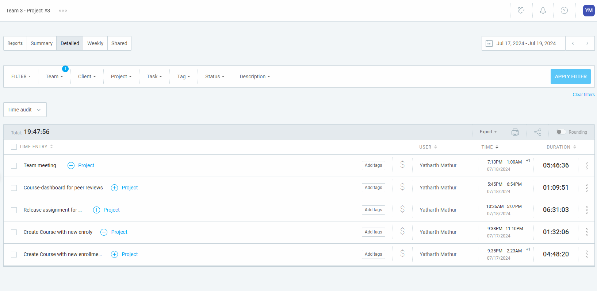
### Current Tasks (Complete by the end of the day)
- Fix randomizer algorithm 
- front end fixes from feedback 

### Progress Update 
<table>
    <tr>
        <td><strong>TASK/ISSUE #</strong>
        </td>
        <td><strong>STATUS</strong>
        </td>
    </tr>
       <tr>
        <!-- Task/Issue # -->
        <td> Randomizer Algorithm   
        </td>
        <!-- Status -->
        <td> In progress 
        </td>
    </tr>
    <tr>
        <!-- Task/Issue # -->
        <td> Course Dashboard View Instructor and Students    
        </td>
        <!-- Status -->
        <td> Done 
        </td>
    </tr>
    <tr>
        <!-- Task/Issue # -->
        <td> Front end fixes and ready for demo    
        </td>
        <!-- Status -->
        <td> Done 
        </td>
    </tr>
  <tr>
        <!-- Task/Issue # -->
        <td> Manual Testing and Jest tests     
        </td>
        <!-- Status -->
        <td> Done 
        </td>
    </tr>
 <tr>
 <tr>
        <!-- Task/Issue # -->
        <td> Email Notifications   
        </td>
        <!-- Status -->
        <td> ToDo
        </td>
    </tr> <tr>
        <!-- Task/Issue # -->
        <td> In-App notifications   
        </td>
        <!-- Status -->
        <td> ToDo
        </td>
    </tr>

     
    
</table>

### Weekly Goal Review :
This cycle felt both short and long! We've finally managed to get the entire assignment submission process working, and the instructor's receipt is the only part left, as the randomizer is still under development. I'm hopeful that we'll reach the 90% completion mark by next Wednesday or Friday and have the app ready for testing!   

### Next Cycle Goals:  
* Randomizer algorithm and functionality 
* Adding update features to all pages
* Group Peer reviews and manual group creation

## Wednesday  (07/17/2024)
### Timesheet Week 9 (07/10/2024- 07/13/2024)
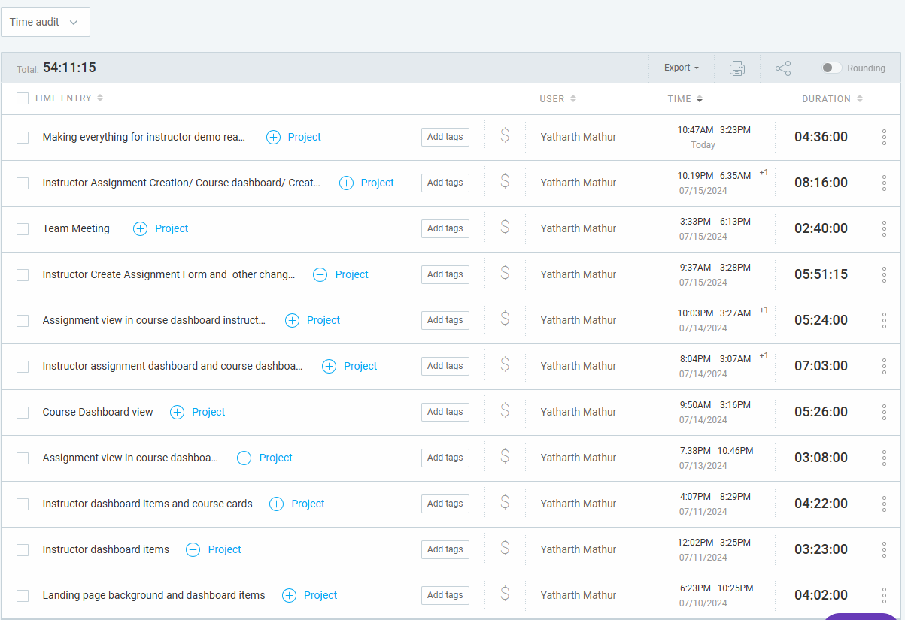

### Current Tasks (Complete by the end of the day)
- All instructor pages front end and UX updated 
- All students pages front end and UX updated
- Application made ready for demo with the entire flow of all the features working, ready for testing 
- Databse refactored and many functions optimized to clean db.ts and work with create assignment. 

### Progress Update 
<table>
    <tr>
        <td><strong>TASK/ISSUE #</strong>
        </td>
        <td><strong>STATUS</strong>
        </td>
    </tr>
    <tr>
        <!-- Task/Issue # -->
        <td> Course Dashboard View Instructor and Students    
        </td>
        <!-- Status -->
        <td> Done 
        </td>
    </tr>
     <tr>
        <!-- Task/Issue # -->
        <td> All other page templates  
        </td>
        <!-- Status -->
        <td> Done 
        </td>
    </tr>
     <tr>
        <!-- Task/Issue # -->
        <td> Instructor and Student dashboard 
        </td>
        <!-- Status -->
        <td> Done 
        </td>
    </tr>
  <tr>
        <!-- Task/Issue # -->
        <td> Randomizer Algorithm   
        </td>
        <!-- Status -->
        <td> In progress 
        </td>
    </tr>
    <tr>
        <!-- Task/Issue # -->
        <td> General Optimization of the Application  
        </td>
        <!-- Status -->
        <td> Done 
        </td>
    </tr>
    
 
 <tr>

     
    
</table>

### Weekly Goal Review :
The project has made substantial progress. Both the instructor and student pages have been updated in terms of front-end and UX, improving the overall user interaction. The application is now demo-ready, with a complete flow of all features operational and set for testing. This ensures a seamless user experience. The database has been refactored and optimized, with numerous functions in the db.ts file cleaned and improved to work efficiently with the ‘create assignment’ feature. These updates collectively result in a more efficient, user-friendly application that is ready for demonstration and further testing.

### Next Cycle Goals:  
* Randomizer algorithm and functionality 
* Adding update features to all pages
* Group Peer reviews and manual group creation 
* Fix everything and hopefully have the entire platform with proper functionality ready for user testing 

 
## Friday  (07/12/2024)
### Timesheet Week 9 (07/10/2024- 07/13/2024)
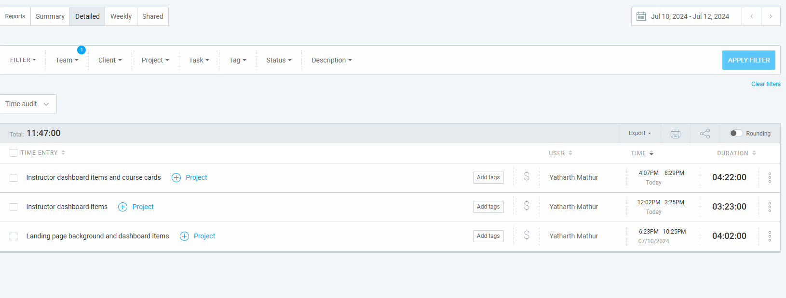

### Current Tasks (Complete by the end of the day)
- Instructor dashboard with breadcrumbs complete
- Instrcutor course dashboard view
- Instrcutor Assignments creation to be updated with NextUI 

### Progress Update 
<table>
    <tr>
        <td><strong>TASK/ISSUE #</strong>
        </td>
        <td><strong>STATUS</strong>
        </td>
    </tr>
    <tr>
        <!-- Task/Issue # -->
        <td> Course Dashboard View Instructor   
        </td>
        <!-- Status -->
        <td> In progress 
        </td>
    </tr>
     <tr>
        <!-- Task/Issue # -->
        <td> Landing Page background set  
        </td>
        <!-- Status -->
        <td> Done 
        </td>
    </tr>
     <tr>
        <!-- Task/Issue # -->
        <td> Instructor dashboard 
        </td>
        <!-- Status -->
        <td> Done 
        </td>
    </tr>
  <tr>
        <!-- Task/Issue # -->
        <td> Randomizer Algorithm   
        </td>
        <!-- Status -->
        <td> In progress 
        </td>
    </tr>
    <tr>
        <!-- Task/Issue # -->
        <td> General Optimization of the Application  
        </td>
        <!-- Status -->
        <td> In progress 
        </td>
    </tr>
    
 
 <tr>

     
    
</table>

### Weekly Goal Review
The instructor dashboard with breadcrumbs is complete, providing a hierarchical view of the site structure. The instructor course dashboard view is under development for a consolidated view of all courses. The instructor assignments creation feature is being updated with NextUI for a more user-friendly interface. The landing page now has a new background, enhancing the visual appeal. A randomizer algorithm is being developed to introduce dynamic elements. General optimization of the application is ongoing to improve performance and efficiency 

### Next Cycle Goals * 
 * Fix the remaining front end items and have the basic UI templates fro each pages
 * Authorization API and forget password needs to be done 
 * Help in optimizing the system 

 (*same as last week as changes are in progress)
## Wednesday (07/09/2024)
### Timesheet Week 7 (07/03/2024- 07/05/2024)
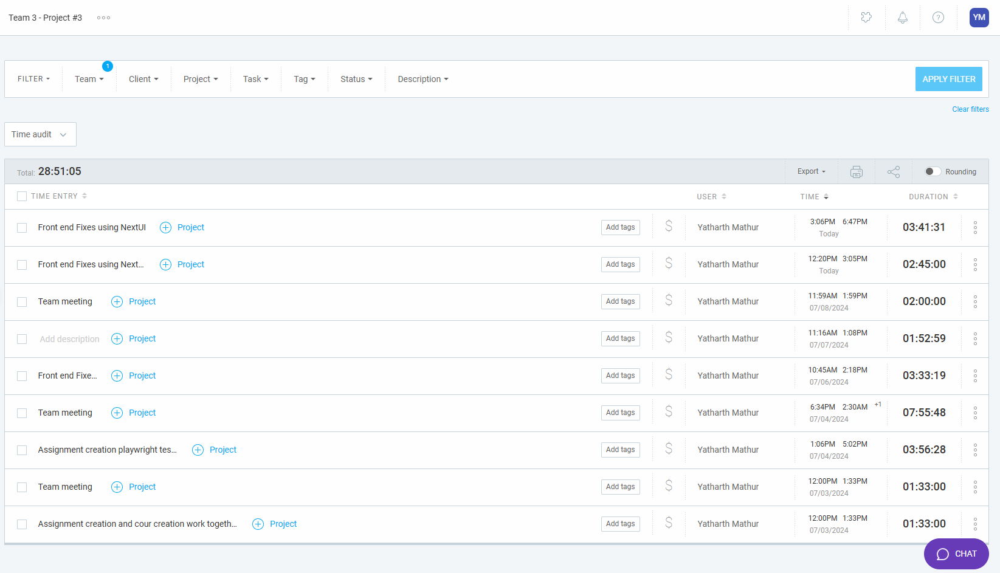

### Current Tasks (Complete by the end of the day)
- Front-end components for instrcutor and student dashboard and course page
- Updating all current CSS to using Next UI.

### Progress Update 
<table>
    <tr>
        <td><strong>TASK/ISSUE #</strong>
        </td>
        <td><strong>STATUS</strong>
        </td>
    </tr>
     <tr>
        <!-- Task/Issue # -->
        <td> Front end fixes for Instructor pages   
        </td>
        <!-- Status -->
        <td> In progress 
        </td>
    </tr>
  <tr>
        <!-- Task/Issue # -->
        <td> Randomizer Algorithm   
        </td>
        <!-- Status -->
        <td> In progress 
        </td>
    </tr>
    <tr>
        <!-- Task/Issue # -->
        <td> General Optimization of the Application  
        </td>
        <!-- Status -->
        <td> In progress 
        </td>
    </tr>
    <tr>
        <!-- Task/Issue # -->
        <td> Set up NextUI framework and its components for a better UI and UX 
        </td>
        <!-- Status -->
        <td> Done 
        </td>
    </tr>
    <tr>
        <!-- Task/Issue # -->
        <td> Refactor logo and app name as per Clients input  
        </td>
        <!-- Status -->
        <td> Done 
        </td>
    </tr>
   
 
 <tr>

     
    
</table>

### Weekly Goal Review
During this cycle, I have mainly inorporated the clients feedback on the fron-end and the logo aspect of the application. The new logo alligns with the new name of the application, Sprint Review. This is an application made by Learnification  and that has been incorporated. The new logo looks like this:

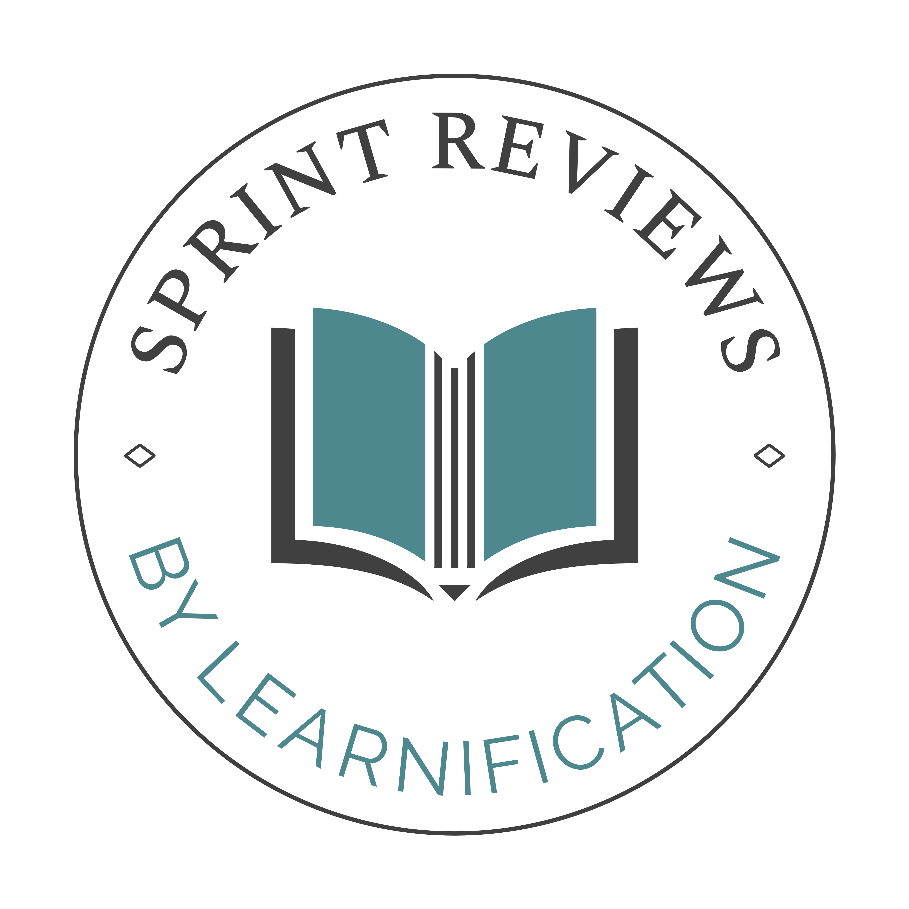

### Next Cycle Goals
 * Fix the remaining front end items and have the basic UI templates fro each pages
 * Authorization API and forget password needs to be done 
 * Help in optiizing the system 
# Week 8 Summary 
## Friday (07/05/2024)

### Timesheet Week 7 (07/03/2024- 07/05/2024)
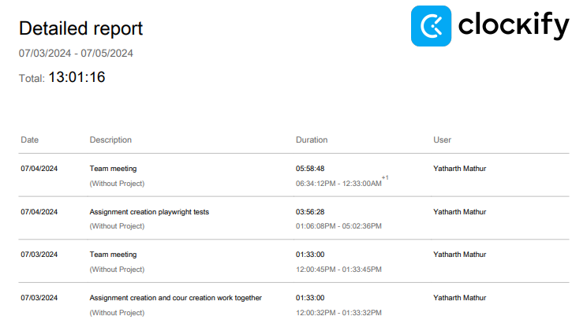

### Current Tasks (Complete by the end of the day)
- MVP presentation feedback meeting
- Discuss the next course of action on the randomizer algorithm 

### Progress Update 
<table>
    <tr>
        <td><strong>TASK/ISSUE #</strong>
        </td>
        <td><strong>STATUS</strong>
        </td>
    </tr>
    <tr>
        <!-- Task/Issue # -->
        <td> Front end instructor dashboard   
        </td>
        <!-- Status -->
        <td> In progress 
        </td>
    </tr>
  <tr>
        <!-- Task/Issue # -->
        <td> Randomizer Algorithm   
        </td>
        <!-- Status -->
        <td> In progress 
        </td>
    </tr>
    <tr>
        <!-- Task/Issue # -->
        <td> General Optimization of the Application  
        </td>
        <!-- Status -->
        <td> In progress 
        </td>
    </tr>
    <tr>
        <!-- Task/Issue # -->
        <td> Manual Student entry back end integration  
        </td>
        <!-- Status -->
        <td> Done
        </td>
    </tr>
 
 <tr>

     
    
</table>

### Weekly Goal Review
During this cycle, I was helping in integrating all the features into the production demo and aided in the optimization of the application to reduce some level of workload on the application. We had a sprint where we fixed all issues and made the product ready for demo.  
### Next Cycle Goals
  * All my feature tests need to be written and tested 
  * The randomizer and the anonymous system need to be created and worked on
  * A Peer Group evaluation system needs to be made
## Wednesday (07/03/2024)

### Timesheet Week 7 (06/26/2024 - 07/03/2024)
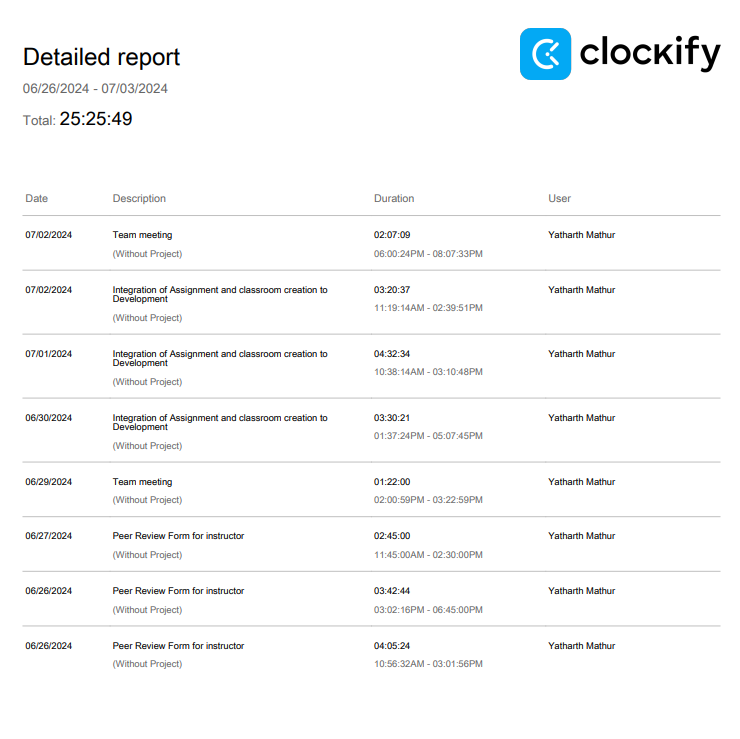

### Current Tasks (Complete by the end of the day)
  * Running all the tests 
  * Optimize and fix the DB queries and have some generalized functions and some specific ones
  * Any items on discussion with MVP will also be assisted by me

### Progress Update 
<table>
    <tr>
        <td><strong>TASK/ISSUE #</strong>
        </td>
        <td><strong>STATUS</strong>
        </td>
    </tr>
  <tr>
        <!-- Task/Issue # -->
        <td> General Optimization of the Application  
        </td>
        <!-- Status -->
        <td> In progress 
        </td>
    </tr>
    <tr>
        <!-- Task/Issue # -->
        <td> General Optimization of the Application  
        </td>
        <!-- Status -->
        <td> In progress 
        </td>
    </tr>
    <tr>
        <!-- Task/Issue # -->
        <td> Manual Student entry back end integration  
        </td>
        <!-- Status -->
        <td> In progress 
        </td>
    </tr>
 <tr>
        <!-- Task/Issue # -->
        <td> Resolve conflicts while Admin Feature to merge into development 
        </td>
        <!-- Status -->
        <td> Done 
        </td>
    </tr>
 <tr>
        <!-- Task/Issue # -->
        <td> Resolve conflicts while Course Creation Feature merges into development 
        </td>
        <!-- Status -->
        <td> Done 
        </td>
    </tr>
    <tr>
        <!-- Task/Issue # -->
        <td>  Resolve conflicts while Assignment Creation and Submission Feature to merge into development 
        </td>
        <!-- Status -->
        <td> Done 
        </td>
    </tr>
 
  <tr>
        <!-- Task/Issue # -->
        <td> Peer Review form for instructor 
        </td>
        <!-- Status -->
        <td> Done 
        </td>
    </tr>
  <tr>
        <!-- Task/Issue # -->
        <td> Rubric Upload handling with restrictions 
        </td>
        <!-- Status -->
        <td> Done 
        </td>
    </tr>
 <tr>

     
    
</table>

### Weekly Goal Review
This week, the focus was primarily on developing the Peer Review Creation form. The objective was to save the base template and the instructor-created rubric to the database. This step enables the commencement of form creation, incorporating the instructor's updated rubric. Additionally, with the assistance of Brenden and Eric, I successfully merged three features into development: the course creation, my assignment creation, and Tithi's assignment creation. Lastly, I have been working on optimizing the software by eliminating duplicate or coupled functions in favor of more generalized functions, again with Brenden's help. 

### Next Cycle Goals
  * All my feature tests need to be written and tested 
  * The randomizer and the anonymous system need to be created and worked on
  * A Peer Group evaluation system needs to be made
 
# Week 6 Summary
## Wednesday (6/26/2024)

### Timesheet Week 5 (06/19/2024 - 06/26/2024)
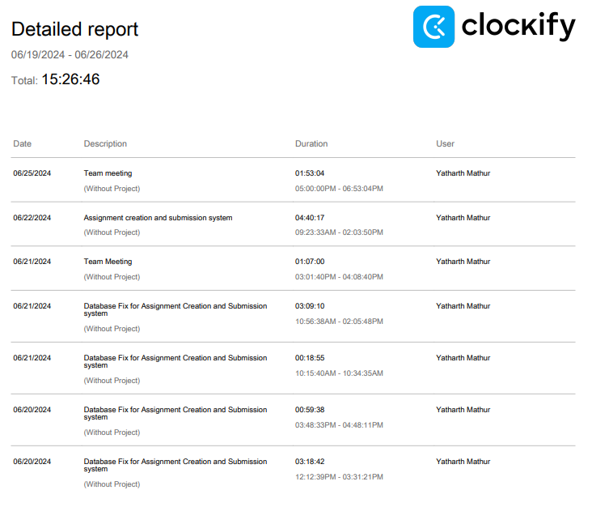

### Current Tasks (Complete by the end of the day)
  * Test the test framework and write tests for Assignment creation
  * Start working on the instructor peer review form with upload of the rubric handled 

### Progress Update 
<table>
    <tr>
        <td><strong>TASK/ISSUE #</strong>
        </td>
        <td><strong>STATUS</strong>
        </td>
    </tr>
  <tr>
        <!-- Task/Issue # -->
        <td> Peer Review form for instructor 
        </td>
        <!-- Status -->
        <td> Todo
        </td>
    </tr>
  <tr>
        <!-- Task/Issue # -->
        <td> Rubric Upload handling with restrictions 
        </td>
        <!-- Status -->
        <td> ToDo
        </td>
    </tr>
 <tr>
        <!-- Task/Issue # -->
        <td> Submit Assignments with file restrictions
        </td>
        <!-- Status -->
        <td> Done
        </td>
    </tr>
 <tr>
        <!-- Task/Issue # -->
        <td> View Assignments from Creation Form
        </td>
        <!-- Status -->
        <td> Done
        </td>
    </tr>
     
    
</table>

### Weekly Goal Review
- I mainly got the instructor assignment creation form to work with the database, where the instructor is exclusively creating assignments for a class and is being handled by the backend to add the information safely
- I got the file upload rubric to convert to text with Tithi for the instructor
- With Tithi, we got the students' submission of assignments to work with the instructor to create an assignment
- I also had a final exam on Monday, so I finished the majority  of the components last week

### Next Cycle Goals
 * Peer review form for instructor to be created
 * The form has rubric upload handling to be done, I will be doing that 
 * Tests to be written for Assignment creation and submission for it to be ready to be tested and help get the DroneCi to work with tests
   
## Friday (6/21/2024)

### Timesheet Week 5 (06/012/2024 - 06/14/2024)
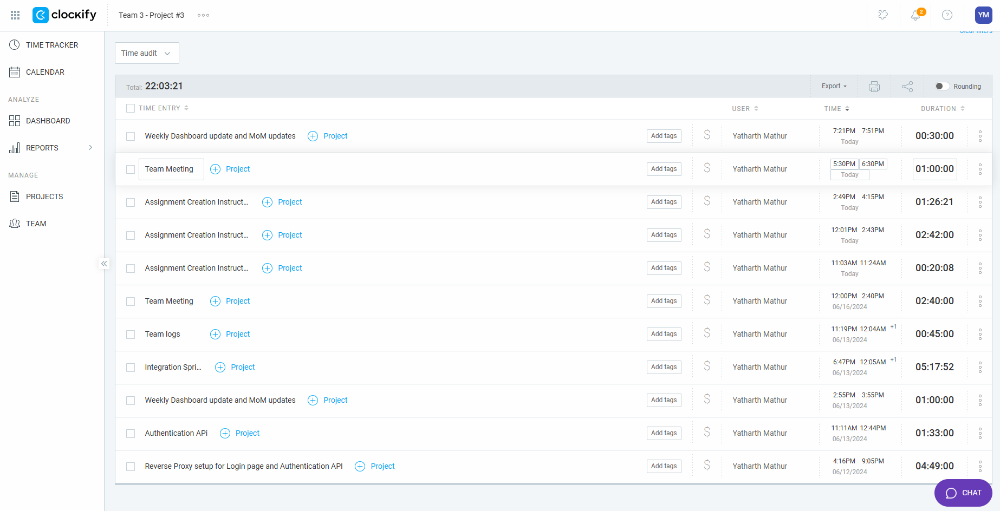

### Current Tasks (Complete by the end of the day)
  * Assignment Creation/Submission system ready for testing
  * Research and decide on authenticator to be implemented
  * Start on Authenticator setup and handle front-end restrictions

### Progress Update 
<table>
    <tr>
        <td><strong>TASK/ISSUE #</strong>
        </td>
        <td><strong>STATUS</strong>
        </td>
    </tr>
  <tr>
        <!-- Task/Issue # -->
        <td> Submit Assignments received by the instructor
        </td>
        <!-- Status -->
        <td> In progress
        </td>
    </tr>
 <tr>
        <!-- Task/Issue # -->
        <td> Submit Assignments with file restrictions
        </td>
        <!-- Status -->
        <td> In progress
        </td>
    </tr>
 <tr>
        <!-- Task/Issue # -->
        <td> View Assignments from Creation Form
        </td>
        <!-- Status -->
        <td> In progress/Portion Completed
        </td>
    </tr><tr>
        <!-- Task/Issue # -->
        <td> Fix MySql connection to System 
        </td>
        <!-- Status -->
        <td> Done
        </td>
    </tr>
  <tr>
        <!-- Task/Issue # -->
        <td> Assignment Creation Form working with Database
        </td>
        <!-- Status -->
        <td> Done
        </td>
    </tr>       
     
    
</table>

### Weekly Goal Review
- We split the features down into sub features and are making it work in isolations following these steps in our developemnt:
    1. Divide the feature into different components 
    1. Split into even sub components worked by two people 
    1. Then we do PR on the code 
    1. Once approoved we will integrate it in pairs and test it (end-to-end,database etc.) before merging to development
- I have rectified the database associated with Tithi to ensure its compatibility with the system. Initially, it was functioning as an isolated container, unable to interact with the system. Upon investigation, I discovered that the ports were not exposed to the system. By addressing this issue, I was able to activate the dynamic database GUI. For this purpose, I opted for MySQL Workbench. 
-  I got the assignment creation form to input all text and date tye, still working on apllying file restrictions with Tithi as we are working on the Assignment creation and Submission system as mentioned in the DFD
-

### Next Cycle Goals
  * Get all of the above tested and ready to go in the owen to cook or deploy in PM terms. 
  * State management of users on site need to work with authenticator API  
  * For Any goals after Friday's meeting go here.
# Week 5 Summary
## Wednesday (6/19/2024)

### Timesheet Week 5 (06/012/2024 - 06/19/2024)

### Current Tasks (Complete by the end of the day)
  * Student View of Assignments
  * Fix to run Drone with tests
  * Any other meeting items/feedback

### Progress Update 
<table>
    <tr>
        <td><strong>TASK/ISSUE #</strong>
        </td>
        <td><strong>STATUS</strong>
        </td>
    </tr>
  <tr>
        <!-- Task/Issue # -->
        <td> Submit Assignments received by the instructor
        </td>
        <!-- Status -->
        <td> To start
        </td>
    </tr>
 <tr>
        <!-- Task/Issue # -->
        <td> Submit Assignments with file restrictions
        </td>
        <!-- Status -->
        <td> To start
        </td>
    </tr>
 <tr>
        <!-- Task/Issue # -->
        <td> View Assignments from Creation Form
        </td>
        <!-- Status -->
        <td> In progress/Portion Completed
        </td>
    </tr> 
  <tr>
        <!-- Task/Issue # -->
        <td> Assignment Creation Form
        </td>
        <!-- Status -->
        <td> Done
        </td>
    </tr> 
    <tr>
        <!-- Task/Issue # -->
        <td> Drone CI integration 
        </td>
        <!-- Status -->
        <td> Done
        </td>
    </tr>   
    <tr>
        <!-- Task/Issue # -->
        <td> Dashboard Creation help 
        </td>
        <!-- Status -->
        <td> Done 
        </td>
    </tr>
 <tr>
        <!-- Task/Issue # -->
        <td> Create and Update Weekly Dashboard
        </td>
        <!-- Status -->
        <td> Done 
        </td>
    </tr>    
        <tr>
        <!-- Task/Issue # -->
        <td> Write tests for all configurations 
        </td>
        <!-- Status -->
        <td> In progress
        </td>
   
    
</table>

### Weekly Goal Review
- Authorization API is working but needs to be redone to work with other API than oAuth
- Assignment Creation form for the instructor is ready to be tested and integrated
-  View of assignment to instructor page for now.

### Next Cycle Goals
 - View assignments for students
 - Submit assignments with restrictions for students
 - Instrcutor receives submitted assignments 

## Friday (6/14/2024)

### Timesheet Week 5 (06/012/2024 - 06/14/2024)
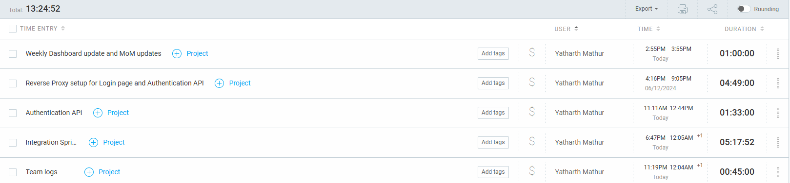

### Current Tasks (Complete by the end of the day)
  * Finish making automated testings

### Progress Update 
<table>
    <tr>
        <td><strong>TASK/ISSUE #</strong>
        </td>
        <td><strong>STATUS</strong>
        </td>
    </tr>
    <tr>
        <!-- Task/Issue # -->
        <td> Integration of the Authorization API with the Login Page
        </td>
        <!-- Status -->
        <td> In Progress/Portion Complete 
        </td>
    </tr>    
    <tr>
        <!-- Task/Issue # -->
        <td> Drone CI integration 
        </td>
        <!-- Status -->
        <td> In Progress/Portion Complete
        </td>
    </tr>
 <tr>
        <!-- Task/Issue # -->
        <td> Create and Update Weekly Dashboard
        </td>
        <!-- Status -->
        <td> Done 
        </td>
    </tr>    
        <tr>
        <!-- Task/Issue # -->
        <td> Write tests for all configurations 
        </td>
        <!-- Status -->
        <td> In progress
        </td>
   
    
</table>

### Weekly Goal Review
- Authentication API runs successfully in isolation and can validate users through their Gmail accounts
- Testing and CI needs to work for future development
-  Created tests for Authentication

### Next Cycle Goals
  * API integration to work with Login & Authentication with response from Database 
  * State management of users on site 
  * For Any goals after Friday's meeting go here.

## Wednesday (6/12/2024)

### Timesheet Week 5 (06/05/2024 - 06/12/2024)
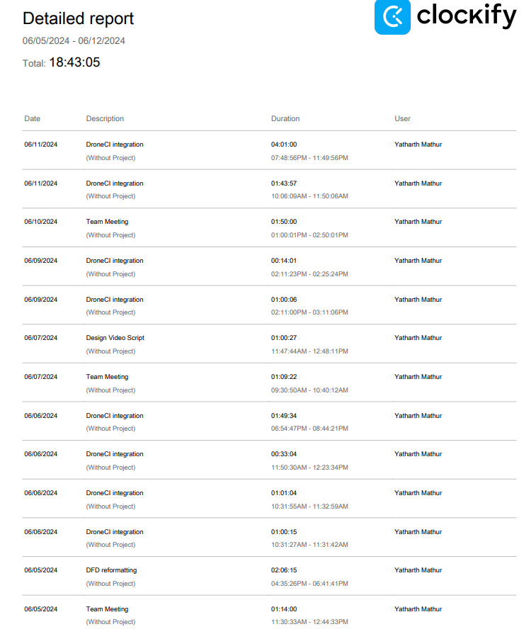

### Current Tasks (Complete by the end of the day)
  * Complete Drone CI, Docker and Playwright testing setup running ok on all PCs
  * Any meeting changes noted here

### Progress Update 
<table>
    <tr>
        <td><strong>TASK/ISSUE #</strong>
        </td>
        <td><strong>STATUS</strong>
        </td>
    </tr>
    <tr>
        <!-- Task/Issue # -->
        <td>Start integration of the Authorization API with the Login Page
        </td>
        <!-- Status -->
        <td> Need to start 
        </td>
    </tr>
    <tr>
        <!-- Task/Issue # -->
        <td> Set Up RP for landing page using the Next.js libraries 
        </td>
        <!-- Status -->
        <td> In-Progress
        </td>
    </tr>
    <tr>
        <!-- Task/Issue # -->
        <td> Drone CI integration 
        </td>
        <!-- Status -->
        <td> Complete/Need test
        </td>
    </tr>
        <tr>
        <!-- Task/Issue # -->
        <td> Write tests for all configurations 
        </td>
        <!-- Status -->
        <td> In progress
        </td>
   
    
</table>

### Weekly Goal Review
- The Drone Ci and Playwright testing to work smoothly still needs to be checked(for now), but the software runs successfully on my local PC
- I have researched and started setting up the RP using nginx.
- I have learnt REACT, Node and Next.js libraries and docs for future feature building 

### Next Cycle Goals
  * API integration to work with Login & authentication and RP to ensure user landing is handled
  * Write tests for API integration (critical)
  * For Any goals after Wednesday's meeting go here.

# Week 4

## Friday (06/07/2024)

### Current Tasks (Complete by the end of the day)
  * Integration of Drone CI with Docker and Framework setup
  * Need to ensure all set up is done during the team meeting and hello world live on all systems
  * Start writing tests based on tests cases

### Progress Update 
<table>
    <tr>
        <td><strong>TASK/ISSUE #</strong>
        </td>
        <td><strong>STATUS</strong>
        </td>
    </tr>
   <tr>
        <!-- Task/Issue # -->
        <td> Help with finalizing UI design
        </td>
        <!-- Status -->
        <td> In progress
        </td>
    </tr>
    <tr>
        <!-- Task/Issue # -->
        <td> Drone CI setup 
        </td>
        <!-- Status -->
        <td> Done
        </td>
    </tr>
 <tr>
        <!-- Task/Issue # -->
        <td> Drone CI Integration 
        </td>
        <!-- Status -->
        <td> In progress
        </td>
    </tr>
    <tr>
        <!-- Task/Issue # -->
        <td> Learn React
        </td>
        <!-- Status -->
        <td> In progress
        </td>
    </tr>
    <tr>
        <!-- Task/Issue # -->
        <td> Learn Next.js
        </td>
        <!-- Status -->
        <td> In progress
        </td>
    </tr>
 <tr>
        <!-- Task/Issue # -->
        <td> Test Cases
        </td>
        <!-- Status -->
        <td> In progress
        </td>
    </tr>
</table>
### Weekly Goal Review
  * I have set up the drone CI to work with GitHub and have to make sure it works on all independent PC. I have met this weeks goal and need to start next cycle items.
  * I had a meeting which was to help with Docker setup 

### Next Cycle Goals
* Writing test cases
* Get features assigned and start development

 ## Week 3
   Team meeting notes / Teams Weekly Tasks 

      - Reading and reviewing the project proposal (my task)
      - Feedback provided needed to be incorporated 
      - Project Proposal video presentation creation (my task)
      - Project Proposal Video creation/editing/compilation
      - Assumptions and Constraints Sections and Tech Stack completion for Proposal submission
      - Design Documentation started 
        - System Architecture Design
        - Use Case Models (my task)
        - Database design
        - DFD Level 0 and 1 (my task)
        - UI Design
        
My tasks to do /done

      - Use case Diagram (1 hr)
      - DFD level 0 (in progress)
      - Use case Scenarios( in progress) 

# Week 3

## Wednesday (6/5/2024)

### Timesheet
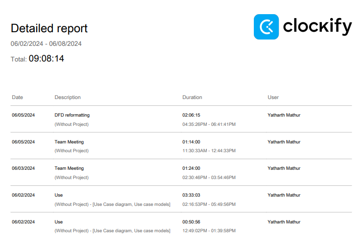

### Current Tasks (Complete by the end of the day)
  * Make changes in DFD as per Kevin's feedback
  * Update the Use case models and diagram to the Design Document

### Progress Update 
<table>
    <tr>
        <td><strong>TASK/ISSUE #</strong>
        </td>
        <td><strong>STATUS</strong>
        </td>
    </tr>
    <tr>
        <!-- Task/Issue # -->
        <td>Start & finish use case diagram and use case descriptions
        </td>
        <!-- Status -->
        <td> Done
        </td>
    </tr>
    <tr>
        <!-- Task/Issue # -->
        <td> Accept and set up clokify as per instructions 
        </td>
        <!-- Status -->
        <td> Done
        </td>
    </tr>
    <tr>
        <!-- Task/Issue # -->
        <td> Drone CI integration 
        </td>
        <!-- Status -->
        <td> In progress
        </td>
    </tr>
        <tr>
        <!-- Task/Issue # -->
        <td> Learn React
        </td>
        <!-- Status -->
        <td> In progress
        </td>
    </tr>
    <tr>
        <!-- Task/Issue # -->
        <td> Meeting w/ client (5/31/2024)
        </td>
        <!-- Status -->
        <td> Done
        </td>
    </tr>
          <tr>
        <!-- Task/Issue # -->
        <td> Help with fininalizng UI design
        </td>
        <!-- Status -->
        <td> In progress
        </td>
    </tr>
    
</table>

### Weekly Goal Review
I have successfully accomplished the planned administrative tasks. I am now to work on the Dron CI integration 

### Next Cycle Goals
  * Drone CI integration 
## Week 2
  Team meeting notes / Teams Weekly Tasks 
  
    - Sprint runners name chosen
    - First official meeting (1 hour)
    - Division of action items on the Project Proposal
      - Requirements, as a whole
      - Presentation Design
      - User Groups (my task)
      - Envisioned Usage (my task)
      - Project Scope
      - Project Boundaries and description
      - UVP
      
  My tasks to do /done    
     
     - User Groups to be introduced for proposal and project ( 1.5 hrs)    
     - Envisioned usage to be added based on User groups (1.5 hrs)
     - General research on other peer-review applications 
## Week 1
    - Meet and greet 
    - Team formations
  
  
    
    
   
