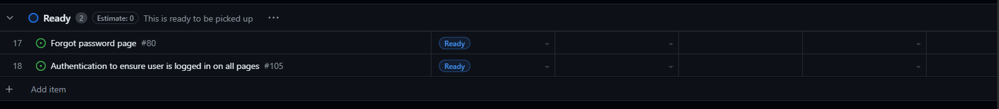
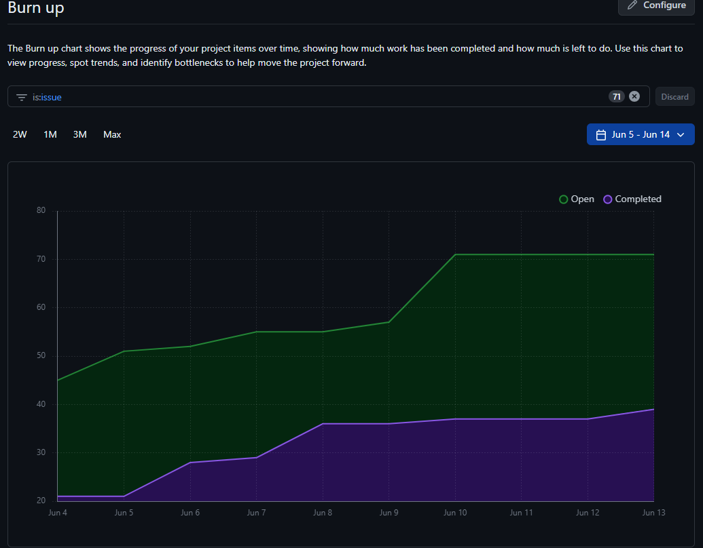

# Project 3: Peer Review System - Team 3 (SprintRunners)

# Weekly Team Logs

# Week 7 summary
## June 26(Wed) - July 2(Tue)

### Features in the Project Plan Cycle: 
- Peer review form for instructor created
- Instructor can add rubric and advanced options
- Instrcutor can manually select students for the peer review
- Base template for student peer review form created
- Last week Items:
    - Assignment Creation with file restriction option for Instrcutor
    - Assignment submission and view for Students
    - Course Creation for instcrutor
    - Student registration in course 

###  Tasks from the Project Board:

### Tasks for Next Cycle:

### Burn-up Chart (Velocity):

### Times for Team/Individual:

Clockify Times:

### Completed Tasks:

### In Progress Tasks/ To do:

### Overview:
This week, significant progress was made in the development of the peer review system. A peer review form was created specifically for instructors. This form allows instructors to add a rubric and other advanced options to guide the review process. In addition, instructors now have the ability to manually select students for the peer review, providing greater control over the review process.

A base template for the student peer review form was also created. This template will serve as a starting point for students when they are conducting peer reviews.

Looking back at the last week, several key features were implemented:

 * Assignment Creation: Instructors now have the ability to create assignments with an option to restrict file types. This ensures that students submit their work in the desired format.
* Assignment Submission and View: Students can now submit their assignments and view them after submission. This provides students with confirmation that their work has been successfully submitted.
* Course Creation: Instructors have the ability to create new courses. This is a crucial feature that allows instructors to manage their teaching materials effectively.
* Student Registration in Course: Students can now register in courses. This feature makes it easy for students to enroll in the courses they are interested in.

Overall, these enhancements significantly improve the functionality and user experience of the system. The team continues to work diligently to implement additional features and improvements

## June 19(Wed) - June 25(Tue)

### Features in the Project Plan Cycle: 

- Assignment Creation with file restriction option for Instrcutor
- Assignment submission and view for Students
- Course Creation for instcrutor
- Student registration in course 

###  Tasks from the Project Board:

### Tasks for Next Cycle:

### Burn-up Chart (Velocity):

### Times for Team/Individual:

Clockify Times:

### Completed Tasks:

### In Progress Tasks/ To do:

### Overview:

The team has made significant progress and has begun constructing the systems according to the data flow diagram (DFD). For a more comprehensive understanding, we have further divided the system into distinct features. We have established a main feature branch that further splits into sub-features.

We have implemented the functionality for assignment creation by the instructor and submission by students (each submission is unique to the student’s ID). In addition, instructors can now create courses and add students to these courses using a .csv file.

These two features operate independently. We have written tests for these features, some of which are still in progress. We have also set up the testing framework to execute these tests. However, end-to-end testing still needs to be conducted. 

## Week 5 

## June 12(Wed) - June 19(Fri)

### Features in the Project Plan Cycle: 

- Landing Page
- Student/Instructor Login page
- Student/Instructor Sign Up
- Database Integration
- Student and Instructor Dashboard
- State Management (instrcuctor\Student states)

###  Tasks from the Project Board:

### Tasks for Next Cycle:

### Burn-up Chart (Velocity):

### Times for Team/Individual:

Clockify Times:

### Completed Tasks:

### In Progress Tasks/ To do:

### Overview:

The team focused on the  mini-presentation and got 3 full stack Features to work with our entire setup. The Kanban Board has been populated with user stories and tasks, milestones have been added, and the dashboard visuals creation has been completed. The next cycle will focus on Assignment Creation and Classroom Creation for Instrcutor, and Students to submit and view assignments(they will need to follow th file restrictions)

## June 12(Wed) - June 14(Fri)
### Features in the Project Plan Cycle: 

- F1: Reverse Proxy for Student/Instructor pages
- F2: Login & Registration with authentication through the database 
- F3 : Static dashboard view with working buttons for non-existent pages

### Associated Tasks from Project Board:

### Tasks for Next Cycle:

### Burn-up Chart (Velocity):

### Times for Team/Individual:

Clockify Times:

### Completed Tasks:

### In Progress Tasks/ To do:

### Test Report / Testing Status:

### Overview:

The team has primarily focused on the three features due on June 14th. Additionally, we have been actively working to establish our CI and testing, which initially presented a roadblock but is now being set up.

## June 7(Fri) - June 12(Wed) 

### Features in the Project Plan Cycle:

-  Feature 1:Choose your role/Reverse Proxy with Frontend and UX
-  Feature 2:Registration and Login Save to Database, the data is stored correctly and displays data correctly
-  Feature 3:Connection Auth API to System and can authenticate users

### Tasks from Project Board:

### Tasks for Next Cycle:

### Burn-up Chart (Velocity):

### Times for Team/Individual:

Clockify Times: 
Clockify Times: 

### Completed Tasks:

### In Progress Tasks/ To do:

### Overview : We have begun the development phase of the project and are working towards delivering the MVP and 3 features of our app by  the end of the next cycle. We are working on building webiste pages and proper setup and integration of APIs and database. To be prepare for our mini presentation on Friday.

## Week 4 

## May 31 (Fri) - June 5 (Wed)

### Features in the Project Plan Cycle:

- Design Proposal Document
- Design Proposal Video
- Framework setup

### Associated Tasks from Project Board:

| Task | Description        | Feature   | Assigned To | Status   |
| ------- | ------------------ | --------- | ----------- | -------- |
| 1   | System Architecture Design | Design Proposal Document| Brendan  | Done |
| 2   | UI Wiredflow  | Design Proposal document | Divyajot  | Done |
| 3   | Database design | Design Proposal document | Eric  | Done |
| 4   | DFDs | Design Proposal document | Yatharth | Done |
| 5   | Use cases | Design Proposal document | Yatharth | Done |

### Alternatively, include image of the project board with tasks and status:

### Tasks for Next Cycle:

| Task  | Description        | Estimated Time (hrs) | Assigned To |
| ------- | ------------------ | -------------------- | ----------- |
| 1   | Video Presentation template design | 2 hrs    | Divyajot  |
| 2   | Video  presentation explanation| 2 hrs     | Brendan, Divyajot,Eric, Tithi, Yatharh  |
| 3   | Video Presentation recording and compilation | 2 hrs    | Divyajot  |
| 4   | Framework setup/Environment setup | 3 hrs | Brendan, Divyajot,Eric, Tithi, Yatharh | 

### Burn-up Chart (Velocity):
Burnup since last meeting:

**Note, the burnup charts were messed up this week by converting all our tasks on the kanban board into issues**

### Times for Team/Individual:

Clockify Times:

### Completed Tasks:
| Task  | Description        | Feature   | Assigned To | Status   |
| ------- | ------------------ | --------- | ----------- | -------- |
| 1   | System Architecture Design | Design Proposal Document| Brendan  | Done |
| 2   | UI Wiredflow  | Design Proposal document | Divyajot  | Done |
| 3   | Database design | Design Proposal document | Eric  | Done |
| 4   | DFDs | Design Proposal document | Yatharth | Done |
| 5   | Use cases | Design Proposal document | Yatharth | Done |

### In Progress Tasks/ To do:

| Task | Description        | Assigned To |
| ------- | ------------------ | ----------- |
| 1   | Review proposal document | Brendan, Divyajot,Eric, Tithi, Yatharh  |

### Cycle Status:
Several tasks were assigned to each of the team during Friday's meeting. By the time of the meeting, each of us accomplished a significant amount of work either completing or nearly completing what was assigned. Though review on all of the work is required, it seems we managed to reach all of our goals for the weekend cycle. Managing the project boards and working on the system architecture design, tasks are being completed on time and everyone is contributing effectively.

## June 5 (Wed) - June 7 (Fri)

### Features in the Project Plan Cycle:

- Design Propsal Video
- Frameworks Setup

### Associated Tasks from Project Board:

| Task  | Description        | Assigned To |Status
| ------- | ------------------ | -------------------- | ----------- |
| 1   | Video Presentation template design | Divyajot  | Done |
| 2   | Video  presentation explanation|  Brendan, Divyajot,Eric, Tithi, Yatharh  | Done|
| 3   | Video Presentation recording and compilation |Divyajot  |Done|
| 4   | Framework setup/Environment setup |  Brendan, Divyajot,Eric, Tithi, Yatharh | In progress|

### Alternatively, include image of the project board with tasks and status:

### Tasks for Next Cycle:

| Task | Description        | Estimated Time (hrs) | Assigned To |
| ------- | ------------------ | -------------------- | ----------- |
| 1   | Docker framework setup | 4 hrs    | Brendan|
| 2  | Create tests | 2 hrs     | Brendan, Divyajot,Eric, Tithi, Yatharth  |
| 3   | Build pages | 2 hrs    | Divyajot,Eric, Tithi  |
| 4   | Reverse proxy |   2 hrs  | Brendan, Yatharth  |
| 5  | Database setup|   2 hrs  | Tithi, Eric  |

### Alternatively, include image of the project board with tasks and status:

### Burn-up Chart (Velocity):
Burnup since last meeting:

Burnup overall:

### Times for Team/Individual:

Clockify Times:

### Completed Tasks:

| Task| Description        | Assigned To |Status
| ------- | ------------------ | -------------------- | ----------- |
| 1  | Video Presentation template design | Divyajot  | Done |
| 2   | Video  presentation explanation|  Brendan, Divyajot,Eric, Tithi, Yatharth  | Done|
| 3   | Video Presentation recording and compilation |Divyajot  |Done|
| 4   | Framework setup/Environment setup |  Brendan, Divyajot,Eric, Tithi, Yatharth | In progress|

### In Progress Tasks/ To do:

| Task | Description        | Assigned To |
| ------- | ------------------ | ----------- |
| 1  | Video Review | Brendan, Divyajot,Eric, Tithi, Yatharth  |

### Overview:

The team focused on reviewing the system designs and UI designs in the project propsal document as well as working on the design proposal video. The Kanban Board has been populated with user stories and tasks, milestones have been added, and the dashboard visuals creation has been completed. The next cycle will focus on deployment of code and delivering the MVP.

--------------------------------------

# Template:
## June 12(Wed) - June 14(Fri)-TBA

### Features in the Project Plan Cycle: TBA

- [Feature 1]
- [Feature 2]
- [Feature 3]
- [Feature 4]
- [Feature 5]

### Associated Tasks from Project Board:

| Task  | Description        | Feature   | Assigned To | Status   |
| ------- | ------------------ | --------- | ----------- | -------- |
| 1   | [Task Description] | [Feature] | [Assignee]  | [Status] |
| 2  | [Task Description] | [Feature] | [Assignee]  | [Status] |

### Alternatively, include image of the project board with tasks and status:

### Tasks for Next Cycle:

| Task | Description        | Estimated Time (hrs) | Assigned To |
| ------- | ------------------ | -------------------- | ----------- |
| 1   | [Task Description] | [Estimated Time]     | [Assignee]  |
| 2  | [Task Description] | [Estimated Time]     | [Assignee]  |

### Alternatively, include image of the project board with tasks and status:

### Burn-up Chart (Velocity):

### Times for Team/Individual:

| Team Member | Logged Hours |
| ----------- | ------------ |
| [Name]      | [Hours]      |
| [Name]      | [Hours]      |
| [Name]      | [Hours]      |

Clockify Times:

### Completed Tasks:

| Task ID | Description        | Completed By |
| ------- | ------------------ | ------------ |
| [#ID]   | [Task Description] | [Assignee]   |
| [#ID]   | [Task Description] | [Assignee]   |

### In Progress Tasks/ To do:

| Task ID | Description        | Assigned To |
| ------- | ------------------ | ----------- |
| [#ID]   | [Task Description] | [Assignee]  |
| [#ID]   | [Task Description] | [Assignee]  |

### Test Report / Testing Status:

N/A

### Overview:

The team focused on [Summary of work done]. The Kanban Board has been populated with user stories and tasks, milestones have been added, and the dashboard visuals creation has been completed. The next cycle will focus on [Tasks for the next cycle]

