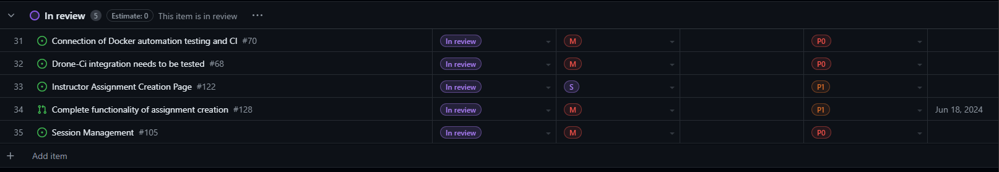

# Project 3: Peer Review System - Team 3 (SprintRunners)

# Week 10 summary (Test-ORAMA week)
 ## July 31st (Wed) - August 2nd (Fri)
 ### Features in the Project Plan Cycle: 
1. User's modifying personal details
2. Instructors leaving feedback on assignments
3. Auto-Calculate Average student Grade for Reviewed Assignment
4. Resubmit Assignment
5. Instructors extending deadlines 
6. Modifying assignments
7. Forgot password page

###  Tasks from the Project Board:

### Tasks for Next Cycle:

### Burn-up Chart (Velocity):

### Times for Team/Individual:

Clockify Times:

### Completed Tasks:

### In Progress Tasks/ To do:

### Test Results 
Playwright :

Jest : 

### Overview:
This week's cycle was slower, yet significant progress was made in the group formation and student view of the dashboard. More work is needed over the weekend to prepare the prototype for testing. Currently, we have some tests ready, and more are in the process of being written.

# Weekly Team Logs
# Week 11 Summary
 ## July 24th (Wed) - July 31st (Wed)
 ### Features in the Project Plan Cycle: 
1. Create Course Groups Functions and edit the course Groups
2. Instructor Release Peer Review system post-randomization with anonymous handling
3. Student View of the form created by the instructor  and the reviews to do
4. Student Side (back-end) feedback is available
5. Addition of functions to handle  all table updates for the updating tables(course, assignment etc.)
6. Instructor ability to edit course details
7. Instructors ability to add and remove students
8. Email Confirmation upon signup
9. Forgot Password Functionality
10. Email notification when assignment is created and when a student is added in a group
   

###  Tasks from the Project Board:

### Tasks for Next Cycle:

### Burn-up Chart (Velocity):

### Times for Team/Individual:

Clockify Times:

### Completed Tasks:

### In Progress Tasks/ To do:

### Test Results 
Playwright :

Jest : 

### Overview:
The Project Plan Cycle includes key features to enhance the learning process. It allows the creation and editing of Course Groups. The Instructor Release Peer Review system ensures fair and anonymous peer assessments. Students can view and complete reviews on the instructor-created form. A feedback mechanism is available for students. The system includes functions for updating all tables, such as course and assignment tables. Instructors can edit course details and manage student enrollment. These features collectively aim to provide a comprehensive and interactive educational experience.
 # Week 10 summary (Test-ORAMA week)
 ## July 24th (Wed) - July 26th (Fri)
 ### Features in the Project Plan Cycle: 
1. Randomizer to work with  instructor peer review dashboard
2. Create a Group feature with all features for group formation in the course
3. Student peer review dashboard

###  Tasks from the Project Board:

### Tasks for Next Cycle:

### Burn-up Chart (Velocity):

### Times for Team/Individual:

Clockify Times:

### Completed Tasks:

### In Progress Tasks/ To do:

### Test Results 
Playwright :

Jest : 

### Overview:
This week's cycle was slower, yet significant progress was made in the group formation and student view of the dashboard. More work is needed over the weekend to prepare the prototype for testing. Currently, we have some tests ready, and more are in the process of being written.

## July 17th (Wed) - July 24th (Wed)
### Features in the Project Plan Cycle: 
1. Fixed the following items as per feedback:
      - Fix Admin Course Archive/Unarchive	https://github.com/UBCO-COSC499-Summer-2024/team-3-capstone-sprint-runners/issues/262
      - Fix User Function Buttons on Right Side Menu	https://github.com/UBCO-COSC499-Summer-2024/team-3-capstone-sprint-runners/issues/263
      - Fix Minor Page Routing Issues	https://github.com/UBCO-COSC499-Summer-2024/team-3-capstone-sprint-runners/issues/268
      - Update UI Page Navigation Buttons	https://github.com/UBCO-COSC499-Summer-2024/team-3-capstone-sprint-runners/issues/267
      - Fix Breadcrumb Navigation	https://github.com/UBCO-COSC499-Summer-2024/team-3-capstone-sprint-runners/issues/264
      - Fix Create Assignment Forms to work in course and form fixes 	https://github.com/UBCO-COSC499-Summer-2024/team-3-capstone-sprint-runners/issues/269
      - Fix Create Course Screen: Image Display	https://github.com/UBCO-COSC499-Summer-2024/team-3-capstone-sprint-runners/issues/265
2. A peer-review randomizer that displays randomized groups is available, with the randomization algorithm functioning to some extent.
3. The Create Course Groups has started to be worked on
4. In-app notifications for all pages are being worked on

###  Tasks from the Project Board:

### Tasks for Next Cycle:

### Burn-up Chart (Velocity):

### Times for Team/Individual:

Clockify Times:

### Completed Tasks:

### In Progress Tasks/ To do:

### Test Results 
Playwright :

Jest : 

### Overview:
Several issues have been addressed based on feedback. These include the resolution of problems with the course archive/unarchive functionality, adjustments to user function buttons, and fixes to minor routing issues. Updates have also been made to the navigation buttons, breadcrumb navigation, and assignment creation forms. The course creation screen now correctly displays images.

In addition to these fixes, new features are being developed. A peer-review randomizer is now available, which displays randomized groups. Work has begun on a feature for creating course groups. Lastly, in-app notifications for all pages are currently under development. These improvements aim to enhance the overall user experience and functionality.
# Week 9 summary
##  July 10th (Wed) - July 17th (Wed)
### Features in the Project Plan Cycle: 
- All instructor pages front end and UX updated 
- All students pages front end and UX updated
- Application made ready for demo with the entire flow of all the features working, ready for testing 
- More than 70 Jest tests written to have database tested 
- Databse refactored and many functions optimized to clean db.ts 

###  Tasks from the Project Board:

### Tasks for Next Cycle:

### Burn-up Chart (Velocity):

### Times for Team/Individual:

Clockify Times:

### Completed Tasks:

### In Progress Tasks/ To do:

### Overview:
The project has seen significant advancements recently. Both the instructor and student pages have undergone front-end and UX updates, enhancing the overall user experience. The application is now demo-ready, with all features fully functional and prepared for testing. This includes a comprehensive flow of all the features, ensuring a smooth user journey. To ensure the robustness of the application, over 70 Jest tests have been written, providing thorough testing of the database. Lastly, the database has been refactored and optimized, with numerous functions cleaned up in the db.ts file, contributing to a more efficient and streamlined codebase. These updates collectively contribute to a more reliable, user-friendly application ready for demonstration and further testing. 
##  July 5th (Fri) - July 10th (Wed)
### Features in the Project Plan Cycle: 
- Tests Database set up 
- Playwright tests working and passing as per expected
- Front end fixes and updates based on Parsa's and MVP feedback

###  Tasks from the Project Board:

### Tasks for Next Cycle:

### Burn-up Chart (Velocity):

### Times for Team/Individual:

Clockify Times:

### Completed Tasks:

### In Progress Tasks/ To do:

### Overview:
Since our last meeting, we have been diligently working on several key tasks. We have successfully set up the Tests Database and ensured its smooth operation. Our Playwright tests are now functioning as expected and all the major tests are passing, confirming the robustness of our system.
In response to the valuable feedback received from Parsa and the MVP presentation, we have to make the  necessary fixes and updates to the front end.
# Week 8 summary ( post-MVP)
##  July 10th (Wed) - July 12th (Fri) 
### Features in the Project Plan Cycle: 
- Landing page background added 
- Instructor and Student Login components fixed to work with NextUI
- Instructor dasboard shows course card and is linked properly
- Instructor create course updated with Next UI 
- Back-end optimization and fixes based on newer plans

###  Tasks from the Project Board:

### Tasks for Next Cycle:

### Burn-up Chart (Velocity):

### Times for Team/Individual:

Clockify Times:

### Completed Tasks:

### In Progress Tasks/ To do:

### Overview:
The landing page now features an engaging new background. Login components for instructors and students have been updated for compatibility with NextUI, enhancing user experience. The instructor dashboard displays course cards and is properly linked for easy navigation. The ‘Create Course’ feature for instructors has been revamped with NextUI for a more intuitive interface. Back-end optimizations have been implemented for improved performance, and several fixes have been made based on updated plans. These updates collectively aim to provide a smoother and more efficient user experience 
##  July 5th (Fri) - July 10th (Wed)
### Features in the Project Plan Cycle: 
- Tests Database set up 
- Playwright tests working and passing as per expected
- Front end fixes and updates based on Parsa's and MVP feedback

###  Tasks from the Project Board:

### Tasks for Next Cycle:

### Burn-up Chart (Velocity):

### Times for Team/Individual:

Clockify Times:

### Completed Tasks:

### In Progress Tasks/ To do:

### Overview:
Since our last meeting, we have been diligently working on several key tasks. We have successfully set up the Tests Database and ensured its smooth operation. Our Playwright tests are now functioning as expected and all the major tests are passing, confirming the robustness of our system.
In response to the valuable feedback received from Parsa and the MVP presentation, we have to make the  necessary fixes and updates to the front end. 
# Week 7 summary (pre-MVP and MVP)
##  July 3rd (Wed) - July 5th (Fri)

### Features in the Project Plan Cycle: 
Final list of features for MVP:
- Login/Create Account
- Assignment creation and submission
- Course creation and Registratiom
- Peer Review creation form for instrcutor 
- Admin Portal  

###  Tasks from the Project Board:

### Tasks for Next Cycle:

### Burn-up Chart (Velocity):

### Times for Team/Individual:

Clockify Times:

### Completed Tasks:

### In Progress Tasks/ To do:

### Overview:

- Overall from last Wednesday's meet we have been fixing and integrating all our features into Production Demo branch and have been working on running integration tests and fixing front-end  for the demo. The MVP presentation was also worked on and all preperations for that 

## June 26(Wed) - July 2(Tue)

### Features in the Project Plan Cycle: 
- Peer review form for instructor created
- Instructor can add rubric and advanced options
- Instrcutor can manually select students for the peer review
- Base template for student peer review form created
- Last week Items:
    - Assignment Creation with file restriction option for Instrcutor
    - Assignment submission and view for Students
    - Course Creation for instcrutor
    - Student registration in course 

###  Tasks from the Project Board:

### Tasks for Next Cycle:

### Burn-up Chart (Velocity):

### Times for Team/Individual:

Clockify Times:

### Completed Tasks:

### In Progress Tasks/ To do:

### Overview:
This week, significant progress was made in the development of the peer review system. A peer review form was created specifically for instructors. This form allows instructors to add a rubric and other advanced options to guide the review process. In addition, instructors now have the ability to manually select students for the peer review, providing greater control over the review process.

A base template for the student peer review form was also created. This template will serve as a starting point for students when they are conducting peer reviews.

Looking back at the last week, several key features were implemented:

 * Assignment Creation: Instructors now have the ability to create assignments with an option to restrict file types. This ensures that students submit their work in the desired format.
* Assignment Submission and View: Students can now submit their assignments and view them after submission. This provides students with confirmation that their work has been successfully submitted.
* Course Creation: Instructors have the ability to create new courses. This is a crucial feature that allows instructors to manage their teaching materials effectively.
* Student Registration in Course: Students can now register in courses. This feature makes it easy for students to enroll in the courses they are interested in.

Overall, these enhancements significantly improve the functionality and user experience of the system. The team continues to work diligently to implement additional features and improvements

## June 19(Wed) - June 25(Tue)

### Features in the Project Plan Cycle: 

- Assignment Creation with file restriction option for Instrcutor
- Assignment submission and view for Students
- Course Creation for instcrutor
- Student registration in course 

###  Tasks from the Project Board:

### Tasks for Next Cycle:

### Burn-up Chart (Velocity):

### Times for Team/Individual:

Clockify Times:

### Completed Tasks:

### In Progress Tasks/ To do:

### Overview:

The team has made significant progress and has begun constructing the systems according to the data flow diagram (DFD). For a more comprehensive understanding, we have further divided the system into distinct features. We have established a main feature branch that further splits into sub-features.

We have implemented the functionality for assignment creation by the instructor and submission by students (each submission is unique to the student’s ID). In addition, instructors can now create courses and add students to these courses using a .csv file.

These two features operate independently. We have written tests for these features, some of which are still in progress. We have also set up the testing framework to execute these tests. However, end-to-end testing still needs to be conducted. 

## Week 5 

## June 12(Wed) - June 19(Fri)

### Features in the Project Plan Cycle: 

- Landing Page
- Student/Instructor Login page
- Student/Instructor Sign Up
- Database Integration
- Student and Instructor Dashboard
- State Management (instrcuctor\Student states)

###  Tasks from the Project Board:

### Tasks for Next Cycle:

### Burn-up Chart (Velocity):

### Times for Team/Individual:

Clockify Times:

### Completed Tasks:

### In Progress Tasks/ To do:

### Overview:

The team focused on the  mini-presentation and got 3 full stack Features to work with our entire setup. The Kanban Board has been populated with user stories and tasks, milestones have been added, and the dashboard visuals creation has been completed. The next cycle will focus on Assignment Creation and Classroom Creation for Instrcutor, and Students to submit and view assignments(they will need to follow th file restrictions)

## June 12(Wed) - June 14(Fri)
### Features in the Project Plan Cycle: 

- F1: Reverse Proxy for Student/Instructor pages
- F2: Login & Registration with authentication through the database 
- F3 : Static dashboard view with working buttons for non-existent pages

### Associated Tasks from Project Board:

### Tasks for Next Cycle:

### Burn-up Chart (Velocity):

### Times for Team/Individual:

Clockify Times:

### Completed Tasks:

### In Progress Tasks/ To do:

### Test Report / Testing Status:

### Overview:

The team has primarily focused on the three features due on June 14th. Additionally, we have been actively working to establish our CI and testing, which initially presented a roadblock but is now being set up.

## June 7(Fri) - June 12(Wed) 

### Features in the Project Plan Cycle:

-  Feature 1:Choose your role/Reverse Proxy with Frontend and UX
-  Feature 2:Registration and Login Save to Database, the data is stored correctly and displays data correctly
-  Feature 3:Connection Auth API to System and can authenticate users

### Tasks from Project Board:

### Tasks for Next Cycle:

### Burn-up Chart (Velocity):

### Times for Team/Individual:

Clockify Times: 
Clockify Times: 

### Completed Tasks:

### In Progress Tasks/ To do:

### Overview : We have begun the development phase of the project and are working towards delivering the MVP and 3 features of our app by  the end of the next cycle. We are working on building webiste pages and proper setup and integration of APIs and database. To be prepare for our mini presentation on Friday.

## Week 4 

## May 31 (Fri) - June 5 (Wed)

### Features in the Project Plan Cycle:

- Design Proposal Document
- Design Proposal Video
- Framework setup

### Associated Tasks from Project Board:

| Task | Description        | Feature   | Assigned To | Status   |
| ------- | ------------------ | --------- | ----------- | -------- |
| 1   | System Architecture Design | Design Proposal Document| Brendan  | Done |
| 2   | UI Wiredflow  | Design Proposal document | Divyajot  | Done |
| 3   | Database design | Design Proposal document | Eric  | Done |
| 4   | DFDs | Design Proposal document | Yatharth | Done |
| 5   | Use cases | Design Proposal document | Yatharth | Done |

### Alternatively, include image of the project board with tasks and status:

### Tasks for Next Cycle:

| Task  | Description        | Estimated Time (hrs) | Assigned To |
| ------- | ------------------ | -------------------- | ----------- |
| 1   | Video Presentation template design | 2 hrs    | Divyajot  |
| 2   | Video  presentation explanation| 2 hrs     | Brendan, Divyajot,Eric, Tithi, Yatharh  |
| 3   | Video Presentation recording and compilation | 2 hrs    | Divyajot  |
| 4   | Framework setup/Environment setup | 3 hrs | Brendan, Divyajot,Eric, Tithi, Yatharh | 

### Burn-up Chart (Velocity):
Burnup since last meeting:

**Note, the burnup charts were messed up this week by converting all our tasks on the kanban board into issues**

### Times for Team/Individual:

Clockify Times:

### Completed Tasks:
| Task  | Description        | Feature   | Assigned To | Status   |
| ------- | ------------------ | --------- | ----------- | -------- |
| 1   | System Architecture Design | Design Proposal Document| Brendan  | Done |
| 2   | UI Wiredflow  | Design Proposal document | Divyajot  | Done |
| 3   | Database design | Design Proposal document | Eric  | Done |
| 4   | DFDs | Design Proposal document | Yatharth | Done |
| 5   | Use cases | Design Proposal document | Yatharth | Done |

### In Progress Tasks/ To do:

| Task | Description        | Assigned To |
| ------- | ------------------ | ----------- |
| 1   | Review proposal document | Brendan, Divyajot,Eric, Tithi, Yatharh  |

### Cycle Status:
Several tasks were assigned to each of the team during Friday's meeting. By the time of the meeting, each of us accomplished a significant amount of work either completing or nearly completing what was assigned. Though review on all of the work is required, it seems we managed to reach all of our goals for the weekend cycle. Managing the project boards and working on the system architecture design, tasks are being completed on time and everyone is contributing effectively.

## June 5 (Wed) - June 7 (Fri)

### Features in the Project Plan Cycle:

- Design Propsal Video
- Frameworks Setup

### Associated Tasks from Project Board:

| Task  | Description        | Assigned To |Status
| ------- | ------------------ | -------------------- | ----------- |
| 1   | Video Presentation template design | Divyajot  | Done |
| 2   | Video  presentation explanation|  Brendan, Divyajot,Eric, Tithi, Yatharh  | Done|
| 3   | Video Presentation recording and compilation |Divyajot  |Done|
| 4   | Framework setup/Environment setup |  Brendan, Divyajot,Eric, Tithi, Yatharh | In progress|

### Alternatively, include image of the project board with tasks and status:

### Tasks for Next Cycle:

| Task | Description        | Estimated Time (hrs) | Assigned To |
| ------- | ------------------ | -------------------- | ----------- |
| 1   | Docker framework setup | 4 hrs    | Brendan|
| 2  | Create tests | 2 hrs     | Brendan, Divyajot,Eric, Tithi, Yatharth  |
| 3   | Build pages | 2 hrs    | Divyajot,Eric, Tithi  |
| 4   | Reverse proxy |   2 hrs  | Brendan, Yatharth  |
| 5  | Database setup|   2 hrs  | Tithi, Eric  |

### Alternatively, include image of the project board with tasks and status:

### Burn-up Chart (Velocity):
Burnup since last meeting:

Burnup overall:

### Times for Team/Individual:

Clockify Times:

### Completed Tasks:

| Task| Description        | Assigned To |Status
| ------- | ------------------ | -------------------- | ----------- |
| 1  | Video Presentation template design | Divyajot  | Done |
| 2   | Video  presentation explanation|  Brendan, Divyajot,Eric, Tithi, Yatharth  | Done|
| 3   | Video Presentation recording and compilation |Divyajot  |Done|
| 4   | Framework setup/Environment setup |  Brendan, Divyajot,Eric, Tithi, Yatharth | In progress|

### In Progress Tasks/ To do:

| Task | Description        | Assigned To |
| ------- | ------------------ | ----------- |
| 1  | Video Review | Brendan, Divyajot,Eric, Tithi, Yatharth  |

### Overview:

The team focused on reviewing the system designs and UI designs in the project propsal document as well as working on the design proposal video. The Kanban Board has been populated with user stories and tasks, milestones have been added, and the dashboard visuals creation has been completed. The next cycle will focus on deployment of code and delivering the MVP.

--------------------------------------

# Template:
## June 12(Wed) - June 14(Fri)-TBA

### Features in the Project Plan Cycle: TBA

- [Feature 1]
- [Feature 2]
- [Feature 3]
- [Feature 4]
- [Feature 5]

### Associated Tasks from Project Board:

| Task  | Description        | Feature   | Assigned To | Status   |
| ------- | ------------------ | --------- | ----------- | -------- |
| 1   | [Task Description] | [Feature] | [Assignee]  | [Status] |
| 2  | [Task Description] | [Feature] | [Assignee]  | [Status] |

### Alternatively, include image of the project board with tasks and status:

### Tasks for Next Cycle:

| Task | Description        | Estimated Time (hrs) | Assigned To |
| ------- | ------------------ | -------------------- | ----------- |
| 1   | [Task Description] | [Estimated Time]     | [Assignee]  |
| 2  | [Task Description] | [Estimated Time]     | [Assignee]  |

### Alternatively, include image of the project board with tasks and status:

### Burn-up Chart (Velocity):

### Times for Team/Individual:

| Team Member | Logged Hours |
| ----------- | ------------ |
| [Name]      | [Hours]      |
| [Name]      | [Hours]      |
| [Name]      | [Hours]      |

Clockify Times:

### Completed Tasks:

| Task ID | Description        | Completed By |
| ------- | ------------------ | ------------ |
| [#ID]   | [Task Description] | [Assignee]   |
| [#ID]   | [Task Description] | [Assignee]   |

### In Progress Tasks/ To do:

| Task ID | Description        | Assigned To |
| ------- | ------------------ | ----------- |
| [#ID]   | [Task Description] | [Assignee]  |
| [#ID]   | [Task Description] | [Assignee]  |

### Test Report / Testing Status:

N/A

### Overview:

The team focused on [Summary of work done]. The Kanban Board has been populated with user stories and tasks, milestones have been added, and the dashboard visuals creation has been completed. The next cycle will focus on [Tasks for the next cycle]

